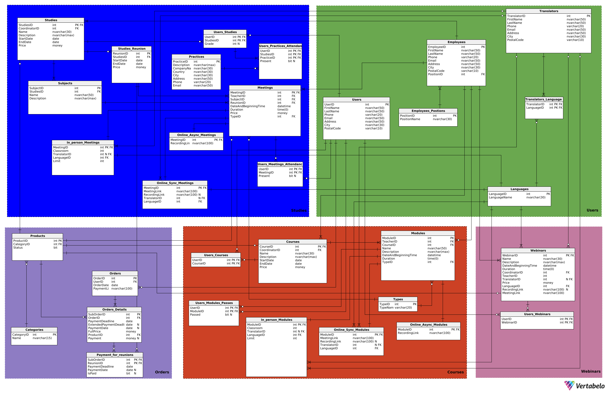

## AUTORZY
1. ***Paweł Sosnowski*** (skrót PS)
2. ***Maciej Słowik*** (skrót MS)

> **Powyższe skróty będą znajdować się przy nazwa i oznaczają jaka osoba co zrobiła.**

## Użytkownicy systemu
1. Administrator
2. Dyrektor platformy
3. Koordynator webinarów
4. Koordynator studiów
5. Koordynator kursów
6. Pracownik sekretariatu
7. Wykładowcy
8. Tłumacze
9. Uczestnik (osoba z założonym kontem)
10. Gość

---

## Funkcje dla każdego użytkownika
1. **Administrator**
    - Możliwość usuwania nagrań z webinarów
    - Możliwość edytowania danych uzytkowników systemu
    - Możliwość edytowania ofert z webinarami
    - Możliwość tworzenia i odtwarzania kopii zapasowych
2. **Dyrektor platformy**
    - Odraczanie płatności dla wybranych klientów
    - Dostęp do raportów generowanych przez system (raporty finansowe, raporty z "listą dłużników", raport związane z przyszłymi wydarzeniami i frekwencją na nich)
    - Możliwość wyrzucania uczestników z kursów/webinarów/studiów
3. **Koordynator webinarów**
    - Dodawanie webinarów
    - Modyfikacja informacji o webinarach
    - Przypisywanie prowadzących czy tłumaczy do webinarów
    - Dodawanie linku do nagrania z webinaru
    - Możliwość usuwanie użytkownika z webinaru
4. **Koordynator kursów**
    - Dodawanie kursów
    - Możliwość modyfikowania właściwości kursów i wybieranie wykładowców czy tłumaczy oraz określanie typu modułów
    - Możliwość decydowania o zaliczeniu kursu (może zmienić decyzję systemu w szeczólnych przypadkach nawet jak uczestnik zaliczył 80% modułów)
    - Możliwość usuwanie użytkownika z kursu
5. **Koordynator studiów**
    - Dodawanie studiów
    - Możliwość dodawania zjadów do studiów
    - Możliwość tworzenia sylabusa studiów poprzez dodawanie przedmiotów:
      - Możliwość przypisywania wykładowców i tłumaczy do danych przedmiotów
      - Możliwość określenia typu danego spotkania przedmotu (stacjnonarnie, online, hybrydowo)
    - Możliwość dodawania i usuwania uczestników danych studiów
    - Możliwość modyfikowania właściwości spotkań studyjnych
    - Możliwość wpisania oceny końcowej z egzaminu 
6. **Pracownik sekretariatu**
    - Możliwość tworzenia harmonogramu zajęć na studiach/kursach i zarządzanie nim
    - Dostęp do raportów generowanych przez system (raporty finansowe, raporty z "listą dłużników", raport związane z przyszłymi wydarzeniami i frekwencją na nich)
    - Możliwość przyjmowania zgłoszeń od użytkowników systemu
    - Dostęp do danych uczestników kursów/studiów/webinarów i możliwość ich modyfikacji
7. **Wykładowcy**
    - Dostęp do swojego harmonogramu zajęć i ich szczegółów
    - Możliwość modyfikacji frekwencji uczestników na swoich zajęciach
    - Dostęp do raportu dotyczącego nieobecności uczestników na swoich zajęciach
    - Dostęp do listy obecności użytkowników
8. **Tłumacze**
    - Dostęp do swojego harmonogramu zajęć i ich szczegółów
9. **Uczestnik (osoba z założonym kontem)**
    - Możliwość dodawania produktów z oferty do koszyka
    - Możliwość wybrania sposobu płatności w przypadku kursu/studiów (zaliczka czy od razu całość)
    - Możliwość przeglądania aktualnych ofert wraz z ich szczegółami
    - Dostęp do harmonogramu kursów/studiów/webinarów, na które wykupił dostęp lub się zapisał
    - Dostęp do nagrań z wykupionych ofert
    - Możliwość zgłoszenia próśb np. o usunięcie z listy uczestników danego kursu/studium
10. **Gość**
    - Możliwość przeglądania aktualnych ofert wraz z ich szczegółami
    - Możliwość stworzenia konta

---

## Funkcje systemu
- Sprawdzanie potwierdzenia płatności (czy udana / czy nieudana)
- Możliwość blokowania dostępu do zasobów w przypadku opoźnienia w płatnościach (nagrania, kursy)
- Rejestrowanie opłat w systemie
- Udzielenie użytkownikowi dostępu do danej usługi w przypadku potwierdzenia płatności
- Możliwość sprawdzenia i zmienienia obecności w wyniku obejrzenia nagrania
- Generowanie raportów:
    - generowanie sprawozdań finansowych, czyli zestawienie przychodów dla 
        każdego kursu/webinaru/studium
    - generowanie listy osób, które zwlekają z opłatą, lista dłużników
    - generowanie listy zapisanych użytkowników na dane wydarzenie oraz informacji o tym wydarzeniu: typ spotkania
    - generowanie raportu o frekwencji dla każdego szkolenia 
    - generowanie raportu o kolizjach w harmonogramie zajęć dla uczestników
- Wyznaczanie ilości wolnych miejsc na studiach/kursach i pilnowanie limitów
- Wysyłanie powiadomień o zaległych płatnościach
- Blokowanie dostępu do nagrań z webinarów po upływie 30 dni
- Generowanie linku do płatności dla użytkownika

## 

---
## Diagram bazy danych

## 

## 

