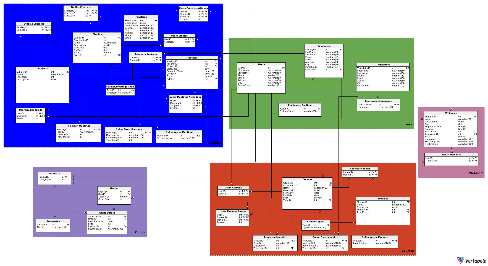

## AUTORZY
1. ***Paweł Sosnowski***
2. ***Maciej Słowik***

## AUTORZY
1. ***Paweł Sosnowski***
2. ***Maciej Słowik***

## Użytkownicy systemu
1. Administrator
2. Dyrektor platformy
3. Koordynator webinarów
4. Koordynator studiów
5. Koordynator kursów
6. Pracownik sekretariatu
7. Wykładowcy
8. Tłumacze
9. Uczestnik (osoba z założonym kontem)
10. Gość

---

## Funkcje dla każdego użytkownika
1. **Administrator**
    - Możliwość usuwania nagrań z webinarów
    - Możliwość edytowania danych uzytkowników systemu
    - Możliwość edytowania ofert z webinarami
    - Możliwość tworzenia i odtwarzania kopii zapasowych
2. **Dyrektor platformy**
    - Odraczanie płatności dla wybranych klientów
    - Dostęp do raportów generowanych przez system (raporty finansowe, raporty z "listą dłużników", raport związane z przyszłymi wydarzeniami i frekwencją na nich)
    - Możliwość zwalniania i zatrudniania pracowników
    - Możliwość wyrzucania uczestników z kursów/webinarów/studiów
3. **Koordynator webinarów**
    - Dodawanie i usuwanie webinarów oraz modyfikowanie ich właściwości
    - Przypisywanie prowadzących czy tłumaczy do webinarów
4. **Koordynator kursów**
    - Dodawanie i usuwanie kursów do oferty
    - Możliwość modyfikowania właściwości kursów i wybieranie wykładowców czy tłumaczy oraz określanie typu modułów
    - Możliwość decydowania o zaliczeniu kursu (może zmienić decyzję systemu w szeczólnych przypadkach nawet jak uczestnik zaliczył 80% modułów)
5. **Koordynator studiów**
    - Dodawanie i usuwanie studiów do oferty
    - Możliwość tworzenia sylabusa studiów poprzez dodawanie przedmiotów:
      - Możliwość przypisywania wykładowców i tłumaczy do danych przedmiotów
      - Możliwość określenia typu danego spotkania przedmotu (stacjnonarnie, online, hybrydowo)
    - Możliwość dodawania i usuwania uczestników danych studiów
    - Możliwość modyfikowania harmonogramu danych studiów
    - Możliwość wpisania oceny końcowej z egzaminu 
6. **Pracownik sekretariatu**
    - Możliwość tworzenia harmonogramu zajęć na studiach/kursach i zarządzanie nim
    - Dostęp do raportów generowanych przez system (raporty finansowe, raporty z "listą dłużników", raport związane z przyszłymi wydarzeniami i frekwencją na nich)
    - Możliwość przyjmowania zgłoszeń od użytkowników systemu
    - Dostęp do danych uczestników kursów/studiów/webinarów i możliwość ich modyfikacji
7. **Wykładowcy**
    - Dostęp do swojego harmonogramu zajęć i ich szczegółów
    - Możliwość modyfikacji frekwencji uczestników na swoich zajęciach
    - Dostęp do raportu dotyczącego nieobecności uczestników na swoich zajęciach
8. **Tłumacze**
    - Dostęp do swojego harmonogramu zajęć i ich szczegółów
9. **Uczestnik (osoba z założonym kontem)**
    - Możliwość zmiany swoich danych osobowych
    - Możliwość dodawania produktów z oferty do koszyka
    - Możliwość wybrania sposobu płatności w przypadku kursu/studiów (zaliczka czy od razu całość)
    - Możliwość przeglądania aktualnych ofert wraz z ich szczegółami
    - Dostęp do harmonogramu kursów/studiów/webinarów, na które wykupił dostęp lub się zapisał
    - Dostęp do nagrań z wykupionych ofert
    - Możliwość zgłoszenia próśb np. o usunięcie z listy uczestników danego kursu/studium
10. **Gość**
    - Możliwość przeglądania aktualnych ofert wraz z ich szczegółami
    - Możliwość stworzenia konta

---

## Funkcje systemu
- Sprawdzanie potwierdzenia płatności (czy udana / czy nieudana)
- Możliwość blokowania dostępu do zasobów w przypadku opoźnienia w płatnościach (nagrania, kursy)
- Rejestrowanie opłat w systemie
- Udzielenie użytkownikowi dostępu do danej usługi w przypadku potwierdzenia płatności
- Możliwość sprawdzenia i zmienienia obecności w wyniku obejrzenia nagrania
- Generowanie raportów:
    - generowanie sprawozdań finansowych, czyli zestawienie przychodów dla 
        każdego kursu/webinaru/studium
    - generowanie listy osób, które zwlekają z opłatą, lista dłużników
    - generowanie listy zapisanych użytkowników na dane wydarzenie oraz informacji o tym wydarzeniu: typ spotkania
    - generowanie raportu o frekwencji dla każdego szkolenia 
    - generowanie raportu o kolizjach w harmonogramie zajęć dla uczestników
- Wyznaczanie ilości wolnych miejsc na studiach/kursach i pilnowanie limitów
- Wysyłanie powiadomień o zaległych płatnościach
- Blokowanie dostępu do nagrań z webinarów po upływie 30 dni
- Generowanie linku do płatności dla użytkownika


## <div class="page"/>
---
## Diagram bazy danych

## 

## <div class="page"/>
---
## Opis poszczególnych tabel

### **Categories**
```sql
CREATE TABLE Categories (
    CategoryID int  NOT NULL,
    Name nvarchar(15)  NOT NULL,
    CONSTRAINT Categories_pk PRIMARY KEY  (CategoryID)
);
```

### **Courses**
```sql
CREATE TABLE Courses (
    CourseID int  NOT NULL,
    CoordinatorID int  NOT NULL,
    Name nvarchar(30)  NOT NULL,
    Description ntext  NOT NULL,
    StartDate date  NOT NULL,
    EndDate date  NOT NULL,
    Price money  NOT NULL,
    TypeID int  NOT NULL,
    CONSTRAINT Courses_pk PRIMARY KEY  (CourseID)
);
```

### **Courses Modules**
```sql
CREATE TABLE Courses Modules (
    CourseID int  NOT NULL,
    ModuleID int  NOT NULL,
    CONSTRAINT Courses Modules_pk PRIMARY KEY  (CourseID,ModuleID)
);
```

### **Courses Types**
```sql
CREATE TABLE Courses Types (
    TypeID int  NOT NULL,
    TypeName varchar(20)  NOT NULL,
    CONSTRAINT TypeID PRIMARY KEY  (TypeID)
);
```

### **Employees**
```sql
CREATE TABLE Employees (
    EmployeeID int  NOT NULL,
    FirstName nvarchar(50)  NOT NULL,
    LastName nvarchar(50)  NOT NULL,
    Phone varchar(15)  NOT NULL,
    Email nvarchar(50)  NOT NULL,
    Address nvarchar(50)  NOT NULL,
    City nvarchar(30)  NOT NULL,
    PostalCode varchar(10)  NOT NULL,
    PositionID int  NOT NULL,
    CONSTRAINT Employees_pk PRIMARY KEY  (EmployeeID)
);
```

### **Employees Postions**
```sql
CREATE TABLE Employees Postions (
    PositionID int  NOT NULL,
    PositionName nvarchar(30)  NOT NULL,
    CONSTRAINT Employees Postions_pk PRIMARY KEY  (PositionID)
);
```

### **In-person Meetings**
```sql
CREATE TABLE In-person Meetings (
    MeetingID int  NOT NULL,
    Faculty nvarchar(10)  NOT NULL,
    Classroom int  NOT NULL,
    TranslatorID int  NOT NULL,
    CONSTRAINT In-person Meetings_pk PRIMARY KEY  (MeetingID)
);
```

### **In-person Modules**
```sql
CREATE TABLE In-person Modules (
    ModuleID int  NOT NULL,
    Faculty nvarchar(10)  NOT NULL,
    Classroom int  NOT NULL,
    TranslatorID int  NOT NULL,
    CONSTRAINT In-person Modules_pk PRIMARY KEY  (ModuleID)
);
```

### **Meetings**
```sql
CREATE TABLE Meetings (
    MeetingID int  NOT NULL,
    TeacherID int  NOT NULL,
    SubjectID int  NOT NULL,
    StartDate date  NOT NULL,
    BeginningTime time(15)  NOT NULL,
    Duration time(15)  NOT NULL,
    Price money  NOT NULL,
    TypeID int  NOT NULL,
    CONSTRAINT MeetingID PRIMARY KEY  (MeetingID)
);
```

### **Modules**
```sql
CREATE TABLE Modules (
    ModuleID int  NOT NULL,
    Name nvarchar(50)  NOT NULL,
    Description ntext  NOT NULL,
    TeacherID int  NOT NULL,
    TypeID int  NOT NULL,
    CONSTRAINT Modules_pk PRIMARY KEY  (ModuleID)
);
```

### **Online Async Meetings**
```sql
CREATE TABLE Online Async Meetings (
    MeetingID int  NOT NULL,
    RecordingLink nvarchar(100)  NOT NULL,
    CONSTRAINT Online Async Meetings_pk PRIMARY KEY  (MeetingID)
);
```

### **Online Async Modules**
```sql
CREATE TABLE Online Async Modules (
    ModuleID int  NOT NULL,
    RecordingLink nvarchar(100)  NOT NULL,
    CONSTRAINT Online Async Modules_pk PRIMARY KEY  (ModuleID)
);
```

### **Online Sync Meetings**
```sql
CREATE TABLE Online Sync Meetings (
    MeetingID int  NOT NULL,
    MeetingLink nvarchar(100)  NOT NULL,
    RecordingLink nvarchar(100)  NOT NULL,
    TranslatorID int  NOT NULL,
    CONSTRAINT Online Sync Meetings_pk PRIMARY KEY  (MeetingID)
);
```

### **Online Sync Modules**
```sql
CREATE TABLE Online Sync Modules (
    ModuleID int  NOT NULL,
    MeetingLink nvarchar(100)  NOT NULL,
    RecordingLink nvarchar(100)  NOT NULL,
    TranslatorID int  NOT NULL,
    CONSTRAINT Online Sync Modules_pk PRIMARY KEY  (ModuleID)
);
```

### **Order Details**
```sql
CREATE TABLE "Order Details" (
    SubOrderID int  NOT NULL,
    OrderID int  NOT NULL,
    PaymentDate date  NOT NULL,
    Price int  NOT NULL,
    ProductID int  NOT NULL,
    PaymentLink nvarchar(100)  NOT NULL,
    CONSTRAINT "Order Details_pk" PRIMARY KEY  (SubOrderID)
);
```

### **Orders**
```sql
CREATE TABLE Orders (
    OrderID int  NOT NULL,
    UserID int  NOT NULL,
    TotalPrice money  NOT NULL,
    OrderDate int  NOT NULL,
    CONSTRAINT Orders_pk PRIMARY KEY  (OrderID)
);
```

### **Practices**
```sql
CREATE TABLE Practices (
    PracticeID int  NOT NULL,
    Description ntext  NOT NULL,
    CompanyName nvarchar(30)  NOT NULL,
    Country nvarchar(30)  NOT NULL,
    City nvarchar(30)  NOT NULL,
    Address nvarchar(30)  NOT NULL,
    Phone varchar(15)  NOT NULL,
    Email nvarchar(50)  NOT NULL,
    CONSTRAINT Practices_pk PRIMARY KEY  (PracticeID)
);
```

### **Products**
```sql
CREATE TABLE Products (
    ProductID int  NOT NULL,
    CategoryID int  NOT NULL,
    CONSTRAINT Products_pk PRIMARY KEY  (ProductID)
);
```

### **Studies**
```sql
CREATE TABLE Studies (
    StudiesID int  NOT NULL,
    CoordinatorID int  NOT NULL,
    Name nvarchar(30)  NOT NULL,
    Description ntext  NOT NULL,
    StartDate date  NOT NULL,
    EndDate date  NOT NULL,
    Price money  NOT NULL,
    TypeID int  NOT NULL,
    CONSTRAINT Studies_pk PRIMARY KEY  (StudiesID)
);
```

### **Studies Practices**
```sql
CREATE TABLE Studies Practices (
    StudiesID int  NOT NULL,
    PracticeID int  NOT NULL,
    StartDate date  NOT NULL,
    CONSTRAINT Studies Practices_pk PRIMARY KEY  (StudiesID,PracticeID)
);
```

### **Studies Subjects**
```sql
CREATE TABLE Studies Subjects (
    StudiesID int  NOT NULL,
    SubjectID int  NOT NULL,
    CONSTRAINT Studies Subjects_pk PRIMARY KEY  (StudiesID,SubjectID)
);
```

### **Studies/Meetings Types**
```sql
CREATE TABLE Studies/Meetings Types (
    TypeID int  NOT NULL,
    TypeName varchar(20)  NOT NULL,
    CONSTRAINT TypeID PRIMARY KEY  (TypeID)
);
```

### **Subjects**
```sql
CREATE TABLE Subjects (
    SubjectID int  NOT NULL,
    Name nvarchar(50)  NOT NULL,
    TeacherID int  NOT NULL,
    Description ntext  NOT NULL,
    CONSTRAINT Subjects_pk PRIMARY KEY  (SubjectID)
);
```

### **Teachers Subjects**
```sql
CREATE TABLE Teachers Subjects (
    TeacherID int  NOT NULL,
    SubjectID int  NOT NULL,
    CONSTRAINT Teachers Subjects_pk PRIMARY KEY  (TeacherID,SubjectID)
);
```

### **Translators**
```sql
CREATE TABLE Translators (
    TranslatorID int  NOT NULL,
    FirstName nvarchar(50)  NOT NULL,
    LastName nvarchar(50)  NOT NULL,
    Phone varchar(15)  NOT NULL,
    Email nvarchar(50)  NOT NULL,
    Address nvarchar(50)  NOT NULL,
    City nvarchar(30)  NOT NULL,
    PostalCode varchar(10)  NOT NULL,
    CONSTRAINT UserID PRIMARY KEY  (TranslatorID)
);
```

### **Translators Languages**
```sql
CREATE TABLE Translators Languages (
    TranslatorID int  NOT NULL,
    Languages nvarchar(30)  NOT NULL,
    CONSTRAINT Translators Languages_pk PRIMARY KEY  (TranslatorID)
);
```

### **User Studies Grade**
```sql
CREATE TABLE "User Studies Grade" (
    UserID int  NOT NULL,
    StudiesID int  NOT NULL,
    Grade int  NOT NULL,
    CONSTRAINT "User Studies Grade_pk" PRIMARY KEY  (UserID,StudiesID)
);
```

### **Users**
```sql
CREATE TABLE Users (
    UserID int  NOT NULL,
    FirstName nvarchar(50)  NOT NULL,
    LastName nvarchar(50)  NOT NULL,
    Phone varchar(15)  NOT NULL,
    Email nvarchar(50)  NOT NULL,
    Address nvarchar(50)  NOT NULL,
    City nvarchar(30)  NOT NULL,
    PostalCode varchar(10)  NOT NULL,
    CONSTRAINT UserID PRIMARY KEY  (UserID)
);
```

### **Users Courses**
```sql
CREATE TABLE Users Courses (
    UserID int  NOT NULL,
    CourseID int  NOT NULL,
    CONSTRAINT Users Courses_pk PRIMARY KEY  (UserID,CourseID)
);
```

### **Users Meetings Attendance**
```sql
CREATE TABLE Users Meetings Attendance (
    UserID int  NOT NULL,
    MeetingID int  NOT NULL,
    SubjectID int  NOT NULL,
    Present bit  NOT NULL,
    CONSTRAINT Users Meetings Attendance_pk PRIMARY KEY  (MeetingID,UserID,SubjectID)
);
```

### **Users Modules Passes**
```sql
CREATE TABLE Users Modules Passes (
    UserID int  NOT NULL,
    CourseID int  NOT NULL,
    ModuleID int  NOT NULL,
    Passed bit  NOT NULL,
    CONSTRAINT UserID PRIMARY KEY  (ModuleID,UserID,CourseID)
);
```

### **Users Practices Attendance**
```sql
CREATE TABLE Users Practices Attendance (
    UserID int  NOT NULL,
    StudiesID int  NOT NULL,
    PracticeID int  NOT NULL,
    Present bit  NOT NULL,
    CONSTRAINT Users Practices Attendance_pk PRIMARY KEY  (UserID,StudiesID,PracticeID)
);
```

### **Users Studies**
```sql
CREATE TABLE Users Studies (
    UserID int  NOT NULL,
    StudiesID int  NOT NULL,
    CONSTRAINT Users Studies_pk PRIMARY KEY  (UserID,StudiesID)
);
```

### **Users Webinars**
```sql
CREATE TABLE Users Webinars (
    UserID int  NOT NULL,
    WebinarID int  NOT NULL,
    CONSTRAINT Users Webinars_pk PRIMARY KEY  (UserID,WebinarID)
);
```

### **Webinars**
```sql
CREATE TABLE Webinars (
    WebinarID int  NOT NULL,
    Name nvarchar(30)  NOT NULL,
    Description ntext  NOT NULL,
    Date date  NOT NULL,
    BeginningTime time(8)  NOT NULL,
    Duration time(8)  NOT NULL,
    TeacherID int  NOT NULL,
    TranslatorID int  NOT NULL,
    Price money  NOT NULL,
    Language nvarchar(30)  NOT NULL,
    RecordingLink nvarchar(100)  NOT NULL,
    MeetingLink nvarchar(100)  NOT NULL,
    CONSTRAINT Webinars_pk PRIMARY KEY  (WebinarID)
);
```

---
## Kod generujący zależności pomiędzy tabelami
```sql
-- Reference: Copy_of_Course Modules_Users Course Attendance (table: Users Meetings Attendance)
ALTER TABLE Users Meetings Attendance ADD CONSTRAINT Copy_of_Course Modules_Users Course Attendance
    FOREIGN KEY (SubjectID)
    REFERENCES Subjects (SubjectID);

-- Reference: Copy_of_Courses with Modules_Course Modules (table: Studies Subjects)
ALTER TABLE Studies Subjects ADD CONSTRAINT "Copy_of_Courses with Modules_Course Modules"
    FOREIGN KEY (SubjectID)
    REFERENCES Subjects (SubjectID);

-- Reference: Copy_of_Courses with Modules_Courses (table: Studies Subjects)
ALTER TABLE Studies Subjects ADD CONSTRAINT "Copy_of_Courses with Modules_Courses"
    FOREIGN KEY (StudiesID)
    REFERENCES Studies (StudiesID);

-- Reference: Copy_of_Courses_Types (table: Studies)
ALTER TABLE Studies ADD CONSTRAINT Copy_of_Courses_Types
    FOREIGN KEY (TypeID)
    REFERENCES Studies/Meetings Types (TypeID);

-- Reference: Copy_of_Courses_Users Courses (table: Users Studies)
ALTER TABLE Users Studies ADD CONSTRAINT Copy_of_Courses_Users Courses
    FOREIGN KEY (StudiesID)
    REFERENCES Studies (StudiesID);

-- Reference: Course Modules_Users Course Attendance (table: Users Modules Passes)
ALTER TABLE Users Modules Passes ADD CONSTRAINT Course Modules_Users Course Attendance
    FOREIGN KEY (ModuleID)
    REFERENCES Modules (ModuleID);

-- Reference: Courses with Modules_Course Modules (table: Courses Modules)
ALTER TABLE Courses Modules ADD CONSTRAINT "Courses with Modules_Course Modules"
    FOREIGN KEY (ModuleID)
    REFERENCES Modules (ModuleID);

-- Reference: Courses with Modules_Courses (table: Courses Modules)
ALTER TABLE Courses Modules ADD CONSTRAINT "Courses with Modules_Courses"
    FOREIGN KEY (CourseID)
    REFERENCES Courses (CourseID);

-- Reference: Courses_Types (table: Courses)
ALTER TABLE Courses ADD CONSTRAINT Courses_Types
    FOREIGN KEY (TypeID)
    REFERENCES Courses Types (TypeID);

-- Reference: Courses_Users Course Credits (table: Users Modules Passes)
ALTER TABLE Users Modules Passes ADD CONSTRAINT Courses_Users Course Credits
    FOREIGN KEY (CourseID)
    REFERENCES Courses (CourseID);

-- Reference: Courses_Users Courses (table: Users Courses)
ALTER TABLE Users Courses ADD CONSTRAINT Courses_Users Courses
    FOREIGN KEY (CourseID)
    REFERENCES Courses (CourseID);

-- Reference: Employees Postions_Employees (table: Employees)
ALTER TABLE Employees ADD CONSTRAINT Employees Postions_Employees
    FOREIGN KEY (PositionID)
    REFERENCES Employees Postions (PositionID);

-- Reference: Employees_Courses (table: Courses)
ALTER TABLE Courses ADD CONSTRAINT Employees_Courses
    FOREIGN KEY (CoordinatorID)
    REFERENCES Employees (EmployeeID);

-- Reference: Employees_Modules (table: Modules)
ALTER TABLE Modules ADD CONSTRAINT Employees_Modules
    FOREIGN KEY (TeacherID)
    REFERENCES Employees (EmployeeID);

-- Reference: In-person Modules_Course Modules (table: In-person Modules)
ALTER TABLE In-person Modules ADD CONSTRAINT In-person Modules_Course Modules
    FOREIGN KEY (ModuleID)
    REFERENCES Modules (ModuleID);

-- Reference: Meetings_Employees (table: Meetings)
ALTER TABLE Meetings ADD CONSTRAINT Meetings_Employees
    FOREIGN KEY (TeacherID)
    REFERENCES Employees (EmployeeID);

-- Reference: Meetings_In-person Meetings (table: In-person Meetings)
ALTER TABLE In-person Meetings ADD CONSTRAINT Meetings_In-person Meetings
    FOREIGN KEY (MeetingID)
    REFERENCES Meetings (MeetingID);

-- Reference: Meetings_Online Async Meetings (table: Online Async Meetings)
ALTER TABLE Online Async Meetings ADD CONSTRAINT Meetings_Online Async Meetings
    FOREIGN KEY (MeetingID)
    REFERENCES Meetings (MeetingID);

-- Reference: Meetings_Online Sync Meetings (table: Online Sync Meetings)
ALTER TABLE Online Sync Meetings ADD CONSTRAINT Meetings_Online Sync Meetings
    FOREIGN KEY (MeetingID)
    REFERENCES Meetings (MeetingID);

-- Reference: Meetings_Studies Types (table: Meetings)
ALTER TABLE Meetings ADD CONSTRAINT Meetings_Studies Types
    FOREIGN KEY (TypeID)
    REFERENCES Studies/Meetings Types (TypeID);

-- Reference: Meetings_Subjects (table: Meetings)
ALTER TABLE Meetings ADD CONSTRAINT Meetings_Subjects
    FOREIGN KEY (SubjectID)
    REFERENCES Subjects (SubjectID);

-- Reference: Meetings_Users Meetings Attendance (table: Users Meetings Attendance)
ALTER TABLE Users Meetings Attendance ADD CONSTRAINT Meetings_Users Meetings Attendance
    FOREIGN KEY (MeetingID)
    REFERENCES Meetings (MeetingID);

-- Reference: Modules_Types (table: Modules)
ALTER TABLE Modules ADD CONSTRAINT Modules_Types
    FOREIGN KEY (TypeID)
    REFERENCES Courses Types (TypeID);

-- Reference: Online Async Modules_Course Modules (table: Online Async Modules)
ALTER TABLE Online Async Modules ADD CONSTRAINT Online Async Modules_Course Modules
    FOREIGN KEY (ModuleID)
    REFERENCES Modules (ModuleID);

-- Reference: Online Sync Modules_Course Modules (table: Online Sync Modules)
ALTER TABLE Online Sync Modules ADD CONSTRAINT Online Sync Modules_Course Modules
    FOREIGN KEY (ModuleID)
    REFERENCES Modules (ModuleID);

-- Reference: Order Details_Orders (table: Order Details)
ALTER TABLE "Order Details" ADD CONSTRAINT "Order Details_Orders"
    FOREIGN KEY (OrderID)
    REFERENCES Orders (OrderID);

-- Reference: Order Details_Products (table: Order Details)
ALTER TABLE "Order Details" ADD CONSTRAINT "Order Details_Products"
    FOREIGN KEY (ProductID)
    REFERENCES Products (ProductID);

-- Reference: Orders_Users (table: Orders)
ALTER TABLE Orders ADD CONSTRAINT Orders_Users
    FOREIGN KEY (UserID)
    REFERENCES Users (UserID);

-- Reference: Products_Category (table: Products)
ALTER TABLE Products ADD CONSTRAINT Products_Category
    FOREIGN KEY (CategoryID)
    REFERENCES Categories (CategoryID);

-- Reference: Products_Courses (table: Products)
ALTER TABLE Products ADD CONSTRAINT Products_Courses
    FOREIGN KEY (ProductID)
    REFERENCES Courses (CourseID);

-- Reference: Products_Meetings (table: Products)
ALTER TABLE Products ADD CONSTRAINT Products_Meetings
    FOREIGN KEY (ProductID)
    REFERENCES Meetings (MeetingID);

-- Reference: Products_Subjects (table: Products)
ALTER TABLE Products ADD CONSTRAINT Products_Subjects
    FOREIGN KEY (ProductID)
    REFERENCES Subjects (SubjectID);

-- Reference: Products_Webinars (table: Products)
ALTER TABLE Products ADD CONSTRAINT Products_Webinars
    FOREIGN KEY (ProductID)
    REFERENCES Webinars (WebinarID);

-- Reference: Studies Practices_Practices (table: Studies Practices)
ALTER TABLE Studies Practices ADD CONSTRAINT Studies Practices_Practices
    FOREIGN KEY (PracticeID)
    REFERENCES Practices (PracticeID);

-- Reference: Studies Practices_Studies (table: Studies Practices)
ALTER TABLE Studies Practices ADD CONSTRAINT Studies Practices_Studies
    FOREIGN KEY (StudiesID)
    REFERENCES Studies (StudiesID);

-- Reference: Studies Practices_Users Practices Attendance (table: Users Practices Attendance)
ALTER TABLE Users Practices Attendance ADD CONSTRAINT Studies Practices_Users Practices Attendance
    FOREIGN KEY (StudiesID,PracticeID)
    REFERENCES Studies Practices (StudiesID,PracticeID);

-- Reference: Studies_User Studies Grade (table: User Studies Grade)
ALTER TABLE "User Studies Grade" ADD CONSTRAINT Studies_User Studies Grade
    FOREIGN KEY (StudiesID)
    REFERENCES Studies (StudiesID);

-- Reference: Subjects_Teachers Subjects (table: Teachers Subjects)
ALTER TABLE Teachers Subjects ADD CONSTRAINT Subjects_Teachers Subjects
    FOREIGN KEY (SubjectID)
    REFERENCES Subjects (SubjectID);

-- Reference: Teachers Subjects_Employees (table: Teachers Subjects)
ALTER TABLE Teachers Subjects ADD CONSTRAINT Teachers Subjects_Employees
    FOREIGN KEY (TeacherID)
    REFERENCES Employees (EmployeeID);

-- Reference: Translators_In-person Modules (table: In-person Modules)
ALTER TABLE In-person Modules ADD CONSTRAINT Translators_In-person Modules
    FOREIGN KEY (TranslatorID)
    REFERENCES Translators (TranslatorID);

-- Reference: Translators_Online Sync Modules (table: Online Sync Modules)
ALTER TABLE Online Sync Modules ADD CONSTRAINT Translators_Online Sync Modules
    FOREIGN KEY (TranslatorID)
    REFERENCES Translators (TranslatorID);

-- Reference: Translators_Translators_Language (table: Translators Languages)
ALTER TABLE Translators Languages ADD CONSTRAINT Translators_Translators_Language
    FOREIGN KEY (TranslatorID)
    REFERENCES Translators (TranslatorID);

-- Reference: User Webinars_Users (table: Users Webinars)
ALTER TABLE Users Webinars ADD CONSTRAINT "User Webinars_Users"
    FOREIGN KEY (UserID)
    REFERENCES Users (UserID);

-- Reference: User Webinars_Webinars (table: Users Webinars)
ALTER TABLE Users Webinars ADD CONSTRAINT "User Webinars_Webinars"
    FOREIGN KEY (WebinarID)
    REFERENCES Webinars (WebinarID);

-- Reference: Users Course Credits_Users (table: Users Modules Passes)
ALTER TABLE Users Modules Passes ADD CONSTRAINT Users Course Credits_Users
    FOREIGN KEY (UserID)
    REFERENCES Users (UserID);

-- Reference: Users Courses_Users (table: Users Courses)
ALTER TABLE Users Courses ADD CONSTRAINT Users Courses_Users
    FOREIGN KEY (UserID)
    REFERENCES Users (UserID);

-- Reference: Users Meetings Attendance_Users (table: Users Meetings Attendance)
ALTER TABLE Users Meetings Attendance ADD CONSTRAINT Users Meetings Attendance_Users
    FOREIGN KEY (UserID)
    REFERENCES Users (UserID);

-- Reference: Users Practices Attendance_Users (table: Users Practices Attendance)
ALTER TABLE Users Practices Attendance ADD CONSTRAINT Users Practices Attendance_Users
    FOREIGN KEY (UserID)
    REFERENCES Users (UserID);

-- Reference: Users Studies_Users (table: Users Studies)
ALTER TABLE Users Studies ADD CONSTRAINT Users Studies_Users
    FOREIGN KEY (UserID)
    REFERENCES Users (UserID);

-- Reference: Users_User Studies Grade (table: User Studies Grade)
ALTER TABLE "User Studies Grade" ADD CONSTRAINT Users_User Studies Grade
    FOREIGN KEY (UserID)
    REFERENCES Users (UserID);

-- Reference: Webinars_Employees (table: Webinars)
ALTER TABLE Webinars ADD CONSTRAINT Webinars_Employees
    FOREIGN KEY (TeacherID)
    REFERENCES Employees (EmployeeID);

-- Reference: Webinars_Translators (table: Webinars)
ALTER TABLE Webinars ADD CONSTRAINT Webinars_Translators
    FOREIGN KEY (TranslatorID)
    REFERENCES Translators (TranslatorID);
```


