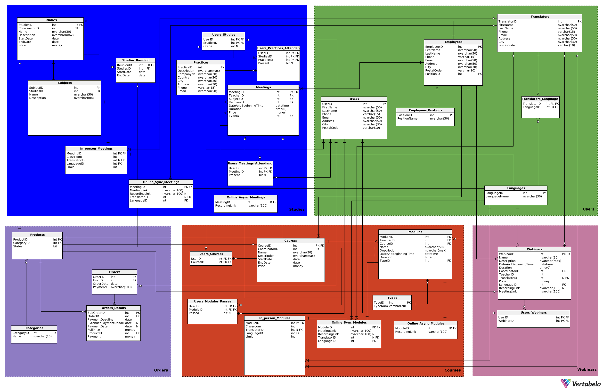

## AUTORZY
1. ***Paweł Sosnowski***
2. ***Maciej Słowik***

## AUTORZY
1. ***Paweł Sosnowski***
2. ***Maciej Słowik***

## Użytkownicy systemu
1. Administrator
2. Dyrektor platformy
3. Koordynator webinarów
4. Koordynator studiów
5. Koordynator kursów
6. Pracownik sekretariatu
7. Wykładowcy
8. Tłumacze
9. Uczestnik (osoba z założonym kontem)
10. Gość

---

## Funkcje dla każdego użytkownika
1. **Administrator**
    - Możliwość usuwania nagrań z webinarów
    - Możliwość edytowania danych uzytkowników systemu
    - Możliwość edytowania ofert z webinarami
    - Możliwość tworzenia i odtwarzania kopii zapasowych
2. **Dyrektor platformy**
    - Odraczanie płatności dla wybranych klientów
    - Dostęp do raportów generowanych przez system (raporty finansowe, raporty z "listą dłużników", raport związane z przyszłymi wydarzeniami i frekwencją na nich)
    - Możliwość zwalniania i zatrudniania pracowników
    - Możliwość wyrzucania uczestników z kursów/webinarów/studiów
3. **Koordynator webinarów**
    - Dodawanie i usuwanie webinarów oraz modyfikowanie ich właściwości
    - Przypisywanie prowadzących czy tłumaczy do webinarów
4. **Koordynator kursów**
    - Dodawanie i usuwanie kursów do oferty
    - Możliwość modyfikowania właściwości kursów i wybieranie wykładowców czy tłumaczy oraz określanie typu modułów
    - Możliwość decydowania o zaliczeniu kursu (może zmienić decyzję systemu w szeczólnych przypadkach nawet jak uczestnik zaliczył 80% modułów)
5. **Koordynator studiów**
    - Dodawanie i usuwanie studiów do oferty
    - Możliwość tworzenia sylabusa studiów poprzez dodawanie przedmiotów:
      - Możliwość przypisywania wykładowców i tłumaczy do danych przedmiotów
      - Możliwość określenia typu danego spotkania przedmotu (stacjnonarnie, online, hybrydowo)
    - Możliwość dodawania i usuwania uczestników danych studiów
    - Możliwość modyfikowania harmonogramu danych studiów
    - Możliwość wpisania oceny końcowej z egzaminu 
6. **Pracownik sekretariatu**
    - Możliwość tworzenia harmonogramu zajęć na studiach/kursach i zarządzanie nim
    - Dostęp do raportów generowanych przez system (raporty finansowe, raporty z "listą dłużników", raport związane z przyszłymi wydarzeniami i frekwencją na nich)
    - Możliwość przyjmowania zgłoszeń od użytkowników systemu
    - Dostęp do danych uczestników kursów/studiów/webinarów i możliwość ich modyfikacji
7. **Wykładowcy**
    - Dostęp do swojego harmonogramu zajęć i ich szczegółów
    - Możliwość modyfikacji frekwencji uczestników na swoich zajęciach
    - Dostęp do raportu dotyczącego nieobecności uczestników na swoich zajęciach
8. **Tłumacze**
    - Dostęp do swojego harmonogramu zajęć i ich szczegółów
9. **Uczestnik (osoba z założonym kontem)**
    - Możliwość zmiany swoich danych osobowych
    - Możliwość dodawania produktów z oferty do koszyka
    - Możliwość wybrania sposobu płatności w przypadku kursu/studiów (zaliczka czy od razu całość)
    - Możliwość przeglądania aktualnych ofert wraz z ich szczegółami
    - Dostęp do harmonogramu kursów/studiów/webinarów, na które wykupił dostęp lub się zapisał
    - Dostęp do nagrań z wykupionych ofert
    - Możliwość zgłoszenia próśb np. o usunięcie z listy uczestników danego kursu/studium
10. **Gość**
    - Możliwość przeglądania aktualnych ofert wraz z ich szczegółami
    - Możliwość stworzenia konta

---

## Funkcje systemu
- Sprawdzanie potwierdzenia płatności (czy udana / czy nieudana)
- Możliwość blokowania dostępu do zasobów w przypadku opoźnienia w płatnościach (nagrania, kursy)
- Rejestrowanie opłat w systemie
- Udzielenie użytkownikowi dostępu do danej usługi w przypadku potwierdzenia płatności
- Możliwość sprawdzenia i zmienienia obecności w wyniku obejrzenia nagrania
- Generowanie raportów:
    - generowanie sprawozdań finansowych, czyli zestawienie przychodów dla 
        każdego kursu/webinaru/studium
    - generowanie listy osób, które zwlekają z opłatą, lista dłużników
    - generowanie listy zapisanych użytkowników na dane wydarzenie oraz informacji o tym wydarzeniu: typ spotkania
    - generowanie raportu o frekwencji dla każdego szkolenia 
    - generowanie raportu o kolizjach w harmonogramie zajęć dla uczestników
- Wyznaczanie ilości wolnych miejsc na studiach/kursach i pilnowanie limitów
- Wysyłanie powiadomień o zaległych płatnościach
- Blokowanie dostępu do nagrań z webinarów po upływie 30 dni
- Generowanie linku do płatności dla użytkownika


## <div class="page"/>
---
## Diagram bazy danych

## 

## <div class="page"/>
---
# ***Opis poszczególnych tabel***
---

# Kategoria Users
---
## Tabela **Users**
Zawiera ona informacje o użytkownikach:
 * **UserID** [int] - klucz główny, identyfikator użytkownika
 * **FirstName** [nvarchar(50)] - imię użytkownika
 * **LastName** [nvarchar(50)] - nazwisko użytkownika
 * **Phone** [varchar(15), unique] - numer telefonu użytkownika 
    * warunki: LEN(Phone) <= 15 AND ISNUMERIC(Phone) = 1
 * **Email** [nvarchar(50), unique] - email użytkownika
    * warunki: Email LIKE '%_@%.%'
 * **Address** [nvarchar(50)] - adres użytkownika
 * **City** [nvarchar(30)] - miasto użytkownika
 * **PostalCode** [varcahr(10)] - kod pocztowy użytkownika
``` SQL
CREATE TABLE Users (
   UserID int  NOT NULL IDENTITY(1, 1),
   FirstName nvarchar(50)  NOT NULL,
   LastName nvarchar(50)  NOT NULL,
   Phone varchar(15)  NOT NULL CHECK (ISNUMERIC(Phone) = 1 AND LEN(PHONE) <= 15),
   Email nvarchar(50)  NOT NULL CHECK (Email LIKE '%_@%.%'),
   Address nvarchar(50)  NOT NULL,
   City nvarchar(30)  NOT NULL,
   PostalCode varchar(10)  NOT NULL,
   CONSTRAINT UserPhone UNIQUE (Phone),
   CONSTRAINT UserEmail UNIQUE (Email),
   CONSTRAINT UserID PRIMARY KEY  (UserID)
);
```

## <hr>
## Tabela **Employees**
Zawiera informacje o pracownikach:
 * **EmployeeID** [int] - klucz główny, identyfikator pracownika
 * **FirstName** [nvarchar(50)] - imię pracownika
 * **LastName** [nvarchar(50)] - nazwisko pracownika
 * **Phone** [varcahr(15), unique] - numer telefonu pracownika
    * warunki: LEN(Phone) <= 15 AND ISNUMERIC(Phone) = 1
 * **Email** [nvarchar(50), unique] - email pracownika
    * warunki: Email LIKE '%_@%.%'
 * **Address** [nvarchar(50)] - adres pracownika
 * **City** [nvarchar(30)] - miasto pracownika
 * **PostalCode** [varchar(10)] - kod pocztowy pracownika
 * **PositionID** [int] - identyfikator pozycji pracownika
```SQL
CREATE TABLE Employees (
   EmployeeID int  NOT NULL IDENTITY(1, 1),
   FirstName nvarchar(50)  NOT NULL,
   LastName nvarchar(50)  NOT NULL,
   Phone varchar(15)  NOT NULL CHECK (ISNUMERIC(Phone) = 1 AND LEN(PHONE) <= 15),
   Email nvarchar(50)  NOT NULL CHECK (Email LIKE '%_@%.%'),
   Address nvarchar(50)  NOT NULL,
   City nvarchar(30)  NOT NULL,
   PostalCode varchar(10)  NOT NULL,
   PositionID int  NOT NULL,
   CONSTRAINT EmployeePhone UNIQUE (Phone),
   CONSTRAINT EmployeeEmail UNIQUE (Email),
   CONSTRAINT EmployeeID PRIMARY KEY  (EmployeeID)
);
```

## <hr>
## Tabela **Employees_Positions**
Zawiera informacje o możliwych pozycjach pracowników:
 * **PositionID** [int] - klucz główny, identyfikator pozycji
 * **PositionName** [nvarchar(30)] - nazwa pozycji
```SQL
CREATE TABLE Employees_Postions (
   PositionID int  NOT NULL IDENTITY(1, 1),
   PositionName nvarchar(30)  NOT NULL,
   CONSTRAINT Employees_Postions_pk PRIMARY KEY  (PositionID)
);
```

## Tabela **Translators**
Zwiera informacje o tłumaczach:
 * **TranslatorID** [int] - klucz główny, identyfikator tłumacza
 * **FirstName** [nvarchar(50)] - imię tłumacza
 * **LastName** [nvarchar(50)] - nazwisko tłumacza
 * **Phone** [varchar(15), unique] - numer telefonu tłumacza
    * warunki: LEN(Phone) <= 15 AND ISNUMERIC(Phone) = 1
 * **Email** [nvarchar(50), unique] - email tłumacza
    * warunki: Email LIKE '%_@%.%'
 * **Address** [nvarchar(50)] - adres tłumacza
 * **City** [nvarchar(30)] - miasto tłumacza
 * **PostalCode** [varchar(10)] - kod pocztowy tłumacza
```SQL
CREATE TABLE Translators (
   TranslatorID int  NOT NULL IDENTITY(1, 1),
   FirstName nvarchar(50)  NOT NULL,
   LastName nvarchar(50)  NOT NULL,
   Phone varchar(15)  NOT NULL CHECK (ISNUMERIC(Phone) = 1 AND LEN(PHONE) <= 15),
   Email nvarchar(50)  NOT NULL CHECK (Email LIKE '%_@%.%'),
   Address nvarchar(50)  NOT NULL,
   City nvarchar(30)  NOT NULL,
   PostalCode varchar(10)  NOT NULL,
   CONSTRAINT TranslatorPhone UNIQUE (Phone),
   CONSTRAINT TranslatorEmail UNIQUE (Email),
   CONSTRAINT TranslatorID PRIMARY KEY  (TranslatorID)
);
```

## <hr>
## Tabela **Translator_Languages**
Zawiera informajce o językach jakimi posługują się tłumacze:
 * **TranslatorID** [int] - część klucza głównego, identyfikator tłumacza
 * **LanguageID** [int] - klucz obcy, identyfikator języka
```SQL
CREATE TABLE Translators_Languages (
   TranslatorID int  NOT NULL,
   LanguageID int  NOT NULL,
   CONSTRAINT Translators_Languages_pk PRIMARY KEY  (TranslatorID,LanguageID)
);
```

## <hr>
## Tabela **Languages**
Zawiera możliwe języki tłumaczenia:
 * **LanguageID** [int] - klucz główny, identyfikator języka
 * **LanguaneName** [nvarchar(30)] - nazwa języka
```SQL
CREATE TABLE Languages (
   LanguageID int  NOT NULL IDENTITY(1, 1),
   LanguageName nvarchar(30)  NOT NULL,
   CONSTRAINT Languages_pk PRIMARY KEY  (LanguageID)
);
```

---
# Kategoria Courses
---

## Tabela **Courses**
Zawiera informacje dotyczące kursów:
- **CourseID** [int] - klucz główny, identyfikator kursu
- **CoordinatorID** [int] - identyfikator koordynatora kursu
- **Name** [nvarchar(30)] - nazwa kursu
- **Description** [nvarchar(max)] - opis kursu
- **StartDate** [date] - data rozpoczęcia kursu w formacie 'rok-miesiąc-dzień'
- **EndDate** [date] - data zakończenia kursu w formacie 'rok-miesiąc-dzień'
- **Price** [money] - cena kursu
  - warunki: Price > 0
  - domyślna wartość: 100

```SQL
CREATE TABLE Courses (
   CourseID int  NOT NULL,
   CoordinatorID int  NOT NULL,
   Name nvarchar(30)  NOT NULL,
   Description nvarchar(max)  NOT NULL,
   StartDate date  NOT NULL,
   EndDate date  NOT NULL,
   Price money  NOT NULL DEFAULT 100 CHECK (Price > 0),
   CONSTRAINT Courses_pk PRIMARY KEY  (CourseID)
);
```

## <hr>
## Tabela In-**person_Modules**
Zawiera informacje o modułach odbywających się stacjonarnie:
- **ModuleID** [int] - klucz główny, identyfikator modułu
- **Classroom** [int] - numer sali, w której odbywają się zajęcia
- **TransalatorID** [int] - identyfikator tłumacza
- **Limit** [int] - limit osób mogących uczestniczyć w danych zajęciach
  - waurnki: Limit > 0
  - domyślna wartość: 25

```SQL
CREATE TABLE In_person_Modules (
   ModuleID int  NOT NULL,
   Classroom int  NOT NULL,
   TranslatorID int  NULL,
   LanguageID int  NOT NULL,
   Limit int  NOT NULL DEFAULT 25 CHECK (Limit > 0),
   CONSTRAINT In_person_Modules_pk PRIMARY KEY  (ModuleID)
);
```

## <hr>
## Tabela **Modules**
Zawiera informacje dotyczące modułów:
- **ModuleID** [int] - klucz główny, identyfikator modułu
- **CourseID** [int] - identyfikator kursu, do którego należy dany moduł
- **Name** [nvarchar(50)] - nazwa modułu
- **Description** [nvarchar(max)] - opis modułu
- **TeacherID** [int] - identyfikator prowadzącego dany moduł
- **DateAndBeginningTime** [datetime] - data i czas rozpoczęcia modułu w formacie "rok:miesiąc:dzień godziny:minuty:sekundy"
- **Duration** [time(8)] - czas trwania modułu w formacie 'godziny:minuty:sekundy'
  - warunki: Duration > 0
  - domyślna wartość: '01:30:00'
- **TypeID** [int] - identyfikator typu modułu
```SQL
CREATE TABLE Modules (
   ModuleID int  NOT NULL IDENTITY(1, 1),
   TeacherID int  NOT NULL,
   CourseID int  NOT NULL,
   Name nvarchar(50)  NOT NULL,
   Description nvarchar(max)  NOT NULL,
   DateAndBeginningTime datetime  NOT NULL,
   Duration time(0)  NOT NULL DEFAULT '01:30:00' CHECK (Duration > '00:00:00'),
   TypeID int  NOT NULL,
   CONSTRAINT Modules_pk PRIMARY KEY  (ModuleID)
);
```
---

## <hr>
## Tabela **Types**
Zawiera informację o możliwych typach modułów czy spotkań:
- **TypeID** [int] - identyfikator typu 
- **TypeName** [varchar(20)] - nazwa typu, określająca sposób jego odbywania się (domyślna 'In-person'):
	- 'In-person' - stacjonarnie
	- 'Online Sync' - online synchronicznie
	- 'Online Async' - online asynchronicznie
	- 'Hybrid' - hybrydowo

```SQL
CREATE TABLE Types (
   TypeID int  NOT NULL IDENTITY(1, 1),
   TypeName varchar(20)  NOT NULL DEFAULT 'In-person' CHECK (TypeName IN ('In-person', 'Online Sync', 'Online Async', 'Hybrid')),
   CONSTRAINT TypeID PRIMARY KEY  (TypeID)
);
```

## <hr>
## Tabela **Online_Async_Modules**
Zawiera informacje o modułach odbywających się online asynchronicznie:
- **ModuleID** [int] - identyfikator modułu
- **RecordingLink** [nvarchar(100)] - link do nagrania

```SQL
CREATE TABLE Online_Async_Modules (
   ModuleID int  NOT NULL,
   RecordingLink nvarchar(100)  NOT NULL,
   CONSTRAINT OnliceAsyncModulesRecordingLInk UNIQUE (RecordingLink),
   CONSTRAINT Online_Async_Modules_pk PRIMARY KEY  (ModuleID)
);
```

## <hr>
## Tabela **Online_Sync_Modules**
Zawiera informacje o modułach odbywających się online synchronicznie:
- **ModuleID** [int] - identyfikator modułu
- **MeetingLink** [nvarchar(100)] - link do spotkania
- **RecordingLink** [nvarchar(100)] - link do nagrania ze spotkania
- **TranslatorID** [int] - identyfikator tłumacza
- **LanguageID** [int] - identyfikator języka

```SQL
CREATE TABLE Online_Sync_Modules (
   ModuleID int  NOT NULL,
   MeetingLink nvarchar(100)  NOT NULL,
   RecordingLink nvarchar(100)  NULL,
   TranslatorID int  NULL,
   LanguageID int  NOT NULL,
   CONSTRAINT OnlineSyncModulesMeetingLink UNIQUE (MeetingLink),
   CONSTRAINT OnlineSyncModulesRecordingLink UNIQUE (RecordingLink),
   CONSTRAINT Online_Sync_Modules_pk PRIMARY KEY  (ModuleID)
);
```

## <hr>
## Tabela **Users_Courses**
Zawiera informacje o tym, na jakie kursy jest zapisany dany użytkownik:
- **UserID** [int] - identyfikator użytkownika
- **CourseID** [int] - identyfikator kursu

```SQL
CREATE TABLE Users_Courses (
   UserID int  NOT NULL,
   CourseID int  NOT NULL,
   CONSTRAINT Users_Courses_pk PRIMARY KEY  (UserID,CourseID)
);
```

## <hr>
## Tabela **Users_Modules_Passes**
Zawiera informację o zaliczeniu poszczególnych modułów
przez danego użytkownika:
- **UserID** [int] - identyfikator użytkownika
- **ModuleID** [int] - identyfikator modułu
- **Passed** [bit] - informacja, czy moduł został zaliczony
przez danego użytkownika (1 - zaliczony, 0 - niezaliczony)

```SQL
CREATE TABLE Users_Modules_Passes (
   UserID int  NOT NULL,
   ModuleID int  NOT NULL,
   Passed bit  NULL,
   CONSTRAINT Users_Modules_Passes_pk PRIMARY KEY  (ModuleID,UserID)
);
```

---
# Kategoria Studies
---

## Tabela **Studies**
Zawiera informajce o dostępnych studiach:
 * **StudiesID** [int] - klucz główny, identyfikator studiów
 * **CoordinatorID** [int] - identyfikator kordynatora studiów
 * **Name** [nvarchar(30)] - nazwa studiów
 * **Description** [ntext] - obpis studiów
 * **StartDate** [date] - data rozpoczęcia studiów
 * **EndDate** [date] - data zakończenia studiów
 * **Price** [money] - cena wpisowego na studiach
   * warunki: Price > 0
   * wartość domyślna: 1200
```SQL
CREATE TABLE Studies (
   StudiesID int  NOT NULL,
   CoordinatorID int  NOT NULL,
   Name nvarchar(30)  NOT NULL,
   Description ntext  NOT NULL,
   StartDate date  NOT NULL,
   EndDate date  NOT NULL,
   Price money  NOT NULL DEFAULT 1200 CHECK (Price > 0),
   CONSTRAINT Studies_pk PRIMARY KEY  (StudiesID)
);
```

## <hr>
## Tabela **Subjects**
Zawiera informajce o przedmiotach:
 * **SubjectID** [int] - klucz główny, identyfikator przedmiotu
 * **StudiesID** [int] - klucz obcy, identyfikator studiów
 * **Name** [nvarchar(50)] - nazwa przedmiotu
 * **TeacherID** [int] - identyfikator koordynatora przedmiotu
 * **Description** [ntext] - opis przedmiotu
```SQL
CREATE TABLE Subjects (
   SubjectID int  NOT NULL,
   StudiesID int  NOT NULL,
   Name nvarchar(50)  NOT NULL,
   TeacherID int  NOT NULL,
   Description ntext  NOT NULL,
   CONSTRAINT Subjects_pk PRIMARY KEY  (SubjectID)
);
```

## <hr>
## Tabela **Meetings**
Zawiera informacje o pojedynczym spotkaniu na studiach z danego przedmiotu:
 * **MeetingID** [int] - klucz główny, identyfikator spotkania
 * **TeacheID** [int] - klucz obcy, identyfikator nauczyciela
 * **SubjectID** [int] - klucz obcy, identyfikator przedmiotu, z którego jest dane spotkanie
 * **ReunionID** [int] - klucz obcy, identyfikaotr zjazdu
 * **Date** [date] - data spotkania
 * **BeginningTime** [time(0)] - godzina rozpoczęcia spotkania
 * **Duration** [time(0)] - czas trwania spotkania
   * warunki: Duration > '00:00:00'
   * wartość domyślna: '01:30:00'
 * **Price** [money] - cena pojedynczego spotkania
   * warunki: Price > 0
   * wartość domyślna: 120
 * **TypeID** [int] - klucz obcy, identyfikator typu spotkania np. stacjonarne itd.
```SQL
CREATE TABLE Meetings (
   MeetingID int  NOT NULL IDENTITY(1, 1),
   TeacherID int  NOT NULL,
   SubjectID int  NOT NULL,
   ReunionID int  NOT NULL,
   DateAndBeginningTime datetime  NOT NULL,
   Duration time(0)  NOT NULL DEFAULT '01:30:00' CHECK (Duration > '00:00:00'),
   Price money  NOT NULL DEFAULT 120 CHECK (Price > 0),
   TypeID int  NOT NULL,
   CONSTRAINT MeetingID PRIMARY KEY  (MeetingID)
);
```

## <hr>
## Tabela **Meeting_Types**
Zawiera informacje o rodzajach typów spotkań:
 * **TypeID** [int] - klucz główny, identyfikator typu
 * **TypeName** [varchar(20)] - nazwa typu
```SQL
CREATE TABLE Meetings_Types (
   TypeID int  NOT NULL,
   TypeName varchar(20)  NOT NULL,
   CONSTRAINT TypeID PRIMARY KEY  (TypeID)
);
```

## <hr>
## Tabela **In-person_Meetings**
Zawiera dodatkowe informacje dla spotkach stacjonarnych:
 * **MeetingID** [int] - klucz główny, identyfikator spotkania
 * **Classroom** [int] - numer sali spotkania
 * **TranslatorID** [int, nullable] - identyfikator tłumacza
 * **LanguageID** [int] - klucz obcy, identyfikator języka w jakim odbywa się spotkanie
 * **Limit** [int] - limit miejsc na spotkaniu
   * warunki: Limit > 0
   * wartość domyślna: 25
```SQL
CREATE TABLE In_person_Meetings (
   MeetingID int  NOT NULL,
   Classroom int  NOT NULL,
   TranslatorID int  NULL,
   LanguageID int  NOT NULL,
   Limit int  NOT NULL DEFAULT 25 CHECK (Limit > 0),
   CONSTRAINT In_person_Meetings_pk PRIMARY KEY  (MeetingID)
);
```

## <hr>
## Tabela **Online_Sync_Meetings**
Zaweira dodatkowe informacje dla spotkań online synchronicznie:
 * **MeetingID** [int] - klucz główny, identyfikator spotkania
 * **MeetingLink** [nvarchar(100)] - link do spotkania
 * **RecodringLink** [nvarchar(100)] - link do nagrania spotkania
 * **TranslatorID** [int, nullable] - identyfikator tłumacza
 * **LanguageID** [int] - identyfiaktor języka w jakim odbywa się spotkanie
```SQL
CREATE TABLE Online_Sync_Meetings (
   MeetingID int  NOT NULL,
   MeetingLink nvarchar(100)  NOT NULL,
   RecordingLink nvarchar(100)  NOT NULL,
   TranslatorID int  NULL,
   LanguageID int  NOT NULL,
   CONSTRAINT Online_Sync_Meetings_pk PRIMARY KEY  (MeetingID)
);
```

## <hr>
## Tabela **Online_Async_Meetings**
Zawiera dodatkowe informacje dla spotkań online asynchronicznie:
 * **MeetingID** [int] - klucz główny, identyfikator spotkania
 * **RecordingLink** [nvarchar(100)] - link do nagrania
```SQL
CREATE TABLE Online_Async_Meetings (
   MeetingID int  NOT NULL,
   RecordingLink nvarchar(100)  NOT NULL,
   CONSTRAINT Online_Async_Meetings_pk PRIMARY KEY  (MeetingID)
);
```

## <hr>
## Tabela **User_Meetings_Attendance**
Zawiera informacje o obecności studenta na spotkaniu:
 * **UserID** [int] - część klucz głównego, identyfikator studenta
 * **MeetingID** [int] - część klucza głównego, identyfikator spotkania
 * **SubjectID** [int] - część klucza głównego, identyfikator przedmiotu
 * **Present** [bit, nullable] - informacja o obecności studenta na spotkaniu
``` SQL
CREATE TABLE Users_Meetings_Attendance (
   UserID int  NOT NULL,
   MeetingID int  NOT NULL,
   SubjectID int  NOT NULL,
   Present bit  NULL,
   CONSTRAINT Users_Meetings_Attendance_pk PRIMARY KEY  (MeetingID,UserID,SubjectID)
);
```

## <hr>
## Tabela **Practices**
Zawiera informacje o firmach gdzie mogą być odbywane praktyki:
 * **PracticeID** [int] - klucz główny, identyfikator praktyki
 * **Description** [ntext] - opis firmy gdzie odbywają się praktyki
 * **CompanyName** [nvarchar(30)] - nazwa firmy
 * **Country** [nvarchar(30)] - kraj gdzie jest zarejestrowana firma
 * **City** [nvarchar(30)] - miasto siedziby firmy
 * **Address** [nvarchar(30)] - adres firmy
 * **Phone** [varchar(15)] - numer telefonu do firmy
   * warunki: LEN(Phone) = 15 AND ISNUMERIC(Phone) = 1
 * **Email** [nvarchar(50)] - email firmy
   * warunki: Email LIKE '%_@%.%'
```SQL
CREATE TABLE Practices (
   PracticeID int  NOT NULL,
   Description ntext  NOT NULL,
   CompanyName nvarchar(30)  NOT NULL,
   Country nvarchar(30)  NOT NULL,
   City nvarchar(30)  NOT NULL,
   Address nvarchar(30)  NOT NULL,
   Phone varchar(15)  NOT NULL CHECK (LEN(Phone) = 15 AND ISNUMERIC(Phone) = 1),
   Email nvarchar(50)  NOT NULL CHECK (Email LIKE '%_@%.%'),
   CONSTRAINT Phone UNIQUE (Phone),
   CONSTRAINT Email UNIQUE (Email),
   CONSTRAINT Practices_pk PRIMARY KEY  (PracticeID)
);
```

## <hr>
## Tabela **Users_Practices_Attendance**
Zawiera informacje o zdaniu praktyk przez danego studenta:
 * **UserID** [int] - część klucz głównego, identyfikator studenta
 * **StudiesID** [int] - część klucza głównego, identyfikator studiów
 * **PracticeID** [int] - część klucza głównego, identyfikator praktyk
 * **Present** [bit, nullable] - informacja o zdaniu praktyk
```SQL
CREATE TABLE Users_Practices_Attendance (
   UserID int  NOT NULL,
   StudiesID int  NOT NULL,
   PracticeID int  NOT NULL,
   Present bit  NULL,
   CONSTRAINT Users_Practices_Attendance_pk PRIMARY KEY  (UserID,StudiesID,PracticeID)
);
```

## <hr>
## Tabela **Users_Studies**
Zawiera informacje studentach przypisanych do danych studiów:
 * **UserID** [int] - część klucza głównego, identyfikator studenta
 * **StudiesID** [int] - część klucza głównego, identyfikator studiów
 * **Grade** [int] - wartość oceny studenta na koniec studiów
   * warunki: Grade >=2 AND Grade <= 5
```SQL
CREATE TABLE Users_Studies (
   UserID int  NOT NULL,
   StudiesID int  NOT NULL,
   Grade int  NULL CHECK (Grade >=2 AND Grade <= 5),
   CONSTRAINT Users_Studies_pk PRIMARY KEY  (UserID,StudiesID)
);
```

## <hr>
## Tabela **Studies_Reunion**
Zawiera ona informacje o zjazdach występujących na danych studiach:
 * **ReunionID** [int] - klucz główny, identyfikator zjazdu
 * **StudiesID** [int] - klucz poboczny, identyfikator studiów
 * **StartDate** [date] - data startu danego zjazdu
 * **EndDate** [date] - data końca danego zjadu
```SQL
CREATE TABLE Studies_Reunion (
   ReunionID int  NOT NULL,
   StudiesID int  NOT NULL,
   StartDate date  NOT NULL,
   EndDate date  NOT NULL,
   CONSTRAINT Studies_Reunion_pk PRIMARY KEY  (ReunionID)
);
```
---
# Kategoria Webinars
---

## Tabela **Users_Webinars**
Zawiera informacje o tym, na jakie Webinary jest zapisany dany użytkownik:
- **UserID** [int] - identyfikator użytkownika
- **WebinarID** [int] - identyfikator webinaru

```SQL
CREATE TABLE Users_Webinars (
   UserID int  NOT NULL,
   WebinarID int  NOT NULL,
   CONSTRAINT Users_Webinars_pk PRIMARY KEY  (UserID,WebinarID)
);
```

## <hr>
## Tabela **Webinars**
---
Zawiera informacje o Webinarach:
- **WebinarID** [int] - identyfikator webinaru
- **Name** [nvarchar(30)] - nazwa webinaru
- **Description** [nvarchar(max)] - opis webinaru
- **Date** [date] - termin odbywania się  webinaru w formacie 'rok-miesiąc-dzień'
- **BeginningTime** [time(8)] - czas rozpoczęcia webinaru w formacie 'godzina:minuty:sekundy'
- **Duration** [time(8)] - czas trwania webinaru w formacie 'godziny:minuty:sekundy'
  - warunki: Duration > '00:00:00'
  - domyślna wartość: '01:30:00;
- **TeacherID** [int] - identyfikator prowadzącego dany webinar
- **TranslatorID** [int] - identyfikator tłumacza
- **Price** [money] - cena webinaru
  - warunki: Price >= 0
  - domyślna wartość: 0
- **LanguageID** [int] - identyfikator języka, w którym prowadzony jest webinar
- **RecordingLink** [nvarchar(100), unique] - link do nagrania z webinaru
- **MeetingLink** [nvarchar(100), unique] - link do webinaru

```SQL
CREATE TABLE Webinars (
   WebinarID int  NOT NULL,
   Name nvarchar(30)  NOT NULL,
   Description nvarchar(max)  NOT NULL,
   DateAndBeginningTime datetime  NOT NULL,
   Duration time(0)  NOT NULL DEFAULT '01:30:00' CHECK (Duration > '00:00:00'),
   CoordinatorID int  NOT NULL,
   TeacherID int  NOT NULL,
   TranslatorID int  NULL,
   Price money  NOT NULL DEFAULT 0 CHECK (Price >= 0),
   LanguageID int  NOT NULL,
   RecordingLink nvarchar(100)  NULL,
   MeetingLink nvarchar(100)  NOT NULL,
   CONSTRAINT WebinarMeetingLink UNIQUE (MeetingLink),
   CONSTRAINT WebinarRecordingLink UNIQUE (RecordingLink),
   CONSTRAINT Webinars_pk PRIMARY KEY  (WebinarID)
);
```

---
# Kategoria Orders
---

## Tabela **Categories**
Zawiera informacje dotyczące kategorii
możliwych do zamówienia usług (produktów):
- **CategoryID** [int] - klucz główny, identyfikator kategorii
- **Name** [nvarchar(15)] - nazwa kategorii:
	- 'Course' - kurs
	- 'Meeting' - spotkanie (zjazd)
	- 'Studies' - studia
	- 'Subject' - przedmiot (zajęcia prowadzone w ramach pewnych studiów)
	- 'Webinar' - webinar
	- 'Reunion' - pojedynczy zjazd na studiach
```SQL
CREATE TABLE Categories (
   CategoryID int  NOT NULL IDENTITY(1, 1),
   Name nvarchar(15)  NOT NULL CHECK (Name IN ('Course', 'Meeting', 'Studies', 'Subject', 'Webinar', 'Reunion')),
   CONSTRAINT Categories_pk PRIMARY KEY  (CategoryID)
);
```

## <hr>
## Tabela **Orders**
Zawiera informacje dotyczące zamówień złożonych przez użytkowników:
- **OrderID** [int] - klucz główny, identyfikator zamówienia
- **UserID** [int] - identyfikator użytkownika składającego zamówienie
- **OrderDate** [date] - data złożenia zamówienia w formacie 'rok-miesiąc-dzień'
- **PaymentLink** [nvarchar(100)] - link do płatności
```SQL
CREATE TABLE Orders (
   OrderID int  NOT NULL,
   UserID int  NOT NULL,
   OrderDate date  NOT NULL,
   PaymentLink nvarchar(100)  NOT NULL,
   CONSTRAINT Orders_pk PRIMARY KEY  (OrderID)
);
```

## <hr>
## Tabela **Orders_Details**
Zawiera informacje szczegółowe dotyczące danego zamówienia
oraz jego zamówień składowych:
- **SubOrderID** [int] - klucz główny, identyfikator zamówienia składowego
- **OrderID** [int] - identyfikator zamówienia
- **PaymentDeadline** [date] - termin, do którego trzeba dokonać
płatności w formacie 'rok-miesiąc-dzień'
- **ExtendedPaymentDeadline** [date] - odroczony termin, do którego
trzeba dokonać płatności w formacie 'rok-miesiąc-dzień' (jeśli jest podany,
to musi być późniejszy od poprzedniego terminu płatności)
- **PaymentDate** [date] - data dokonania płatności za dane zamówienie składowe
w formacie 'rok-miesiąc-dzień'
- **FullPrice** [money] - pełna cena za dany produkt
- **ProductID** [int] - identyfikator zamawianego produktu
- **Payment** [money] - wartość jaka została zapłacona za dany produkt np. za wpisowa na kurs czy studia
```SQL
CREATE TABLE Orders_Details (
   SubOrderID int  NOT NULL IDENTITY(1, 1),
   OrderID int  NOT NULL,
   PaymentDeadline date  NOT NULL,
   ExtendedPaymentDeadline date  NULL,
   PaymentDate date  NULL,
   FullPrice money  NOT NULL CHECK (Price >= 0),
   ProductID int  NOT NULL,
   Payment money  NOT NULL CHECK (Payment >= 0),
   CONSTRAINT Orders_Details_pk PRIMARY KEY  (SubOrderID)
);
```

## <hr>
## Tabela **Products**
Zawiera informacje o dostępnych produktach (usługach):
- **ProductID** [int] - klucz główny, identyfikator produktu
- **CategoryID** [int] - identyfikator kategorii produktu
```SQL
CREATE TABLE Products (
   ProductID int  NOT NULL,
   CategoryID int  NOT NULL,
   CONSTRAINT Products_pk PRIMARY KEY  (ProductID)
);
```


---
# Zależności między tabelami
---
```SQL
-- Created by Vertabelo (http://vertabelo.com)
-- Last modification date: 2025-01-07 22:07:46.968

-- foreign keys
-- Reference: Courses_Users_Courses (table: Users_Courses)
ALTER TABLE Users_Courses ADD CONSTRAINT Courses_Users_Courses
    FOREIGN KEY (CourseID)
    REFERENCES Courses (CourseID);

-- Reference: Employees_Courses (table: Courses)
ALTER TABLE Courses ADD CONSTRAINT Employees_Courses
    FOREIGN KEY (CoordinatorID)
    REFERENCES Employees (EmployeeID);

-- Reference: Employees_Modules (table: Modules)
ALTER TABLE Modules ADD CONSTRAINT Employees_Modules
    FOREIGN KEY (TeacherID)
    REFERENCES Employees (EmployeeID);

-- Reference: Employees_Postions_Employees (table: Employees)
ALTER TABLE Employees ADD CONSTRAINT Employees_Postions_Employees
    FOREIGN KEY (PositionID)
    REFERENCES Employees_Postions (PositionID);

-- Reference: In_person_Meetings_Languages (table: In_person_Meetings)
ALTER TABLE In_person_Meetings ADD CONSTRAINT In_person_Meetings_Languages
    FOREIGN KEY (LanguageID)
    REFERENCES Languages (LanguageID);

-- Reference: In_person_Meetings_Translators (table: In_person_Meetings)
ALTER TABLE In_person_Meetings ADD CONSTRAINT In_person_Meetings_Translators
    FOREIGN KEY (TranslatorID)
    REFERENCES Translators (TranslatorID);

-- Reference: In_person_Modules_Languages (table: In_person_Modules)
ALTER TABLE In_person_Modules ADD CONSTRAINT In_person_Modules_Languages
    FOREIGN KEY (LanguageID)
    REFERENCES Languages (LanguageID);

-- Reference: Meetings_Employees (table: Meetings)
ALTER TABLE Meetings ADD CONSTRAINT Meetings_Employees
    FOREIGN KEY (TeacherID)
    REFERENCES Employees (EmployeeID);

-- Reference: Meetings_In_person_Meetings (table: In_person_Meetings)
ALTER TABLE In_person_Meetings ADD CONSTRAINT Meetings_In_person_Meetings
    FOREIGN KEY (MeetingID)
    REFERENCES Meetings (MeetingID);

-- Reference: Meetings_Modules_Types (table: Meetings)
ALTER TABLE Meetings ADD CONSTRAINT Meetings_Modules_Types
    FOREIGN KEY (TypeID)
    REFERENCES Types (TypeID);

-- Reference: Meetings_Online_Async_Meetings (table: Online_Async_Meetings)
ALTER TABLE Online_Async_Meetings ADD CONSTRAINT Meetings_Online_Async_Meetings
    FOREIGN KEY (MeetingID)
    REFERENCES Meetings (MeetingID);

-- Reference: Meetings_Online_Sync_Meetings (table: Online_Sync_Meetings)
ALTER TABLE Online_Sync_Meetings ADD CONSTRAINT Meetings_Online_Sync_Meetings
    FOREIGN KEY (MeetingID)
    REFERENCES Meetings (MeetingID);

-- Reference: Meetings_Studies_Reunion (table: Meetings)
ALTER TABLE Meetings ADD CONSTRAINT Meetings_Studies_Reunion
    FOREIGN KEY (ReunionID)
    REFERENCES Studies_Reunion (ReunionID);

-- Reference: Meetings_Subjects (table: Meetings)
ALTER TABLE Meetings ADD CONSTRAINT Meetings_Subjects
    FOREIGN KEY (SubjectID)
    REFERENCES Subjects (SubjectID);

-- Reference: Meetings_Users_Meetings_Attendance (table: Users_Meetings_Attendance)
ALTER TABLE Users_Meetings_Attendance ADD CONSTRAINT Meetings_Users_Meetings_Attendance
    FOREIGN KEY (MeetingID)
    REFERENCES Meetings (MeetingID);

-- Reference: Modules_Courses (table: Modules)
ALTER TABLE Modules ADD CONSTRAINT Modules_Courses
    FOREIGN KEY (CourseID)
    REFERENCES Courses (CourseID);

-- Reference: Modules_In_person_Modules (table: In_person_Modules)
ALTER TABLE In_person_Modules ADD CONSTRAINT Modules_In_person_Modules
    FOREIGN KEY (ModuleID)
    REFERENCES Modules (ModuleID);

-- Reference: Modules_Online_Async_Modules (table: Online_Async_Modules)
ALTER TABLE Online_Async_Modules ADD CONSTRAINT Modules_Online_Async_Modules
    FOREIGN KEY (ModuleID)
    REFERENCES Modules (ModuleID);

-- Reference: Modules_Online_Sync_Modules (table: Online_Sync_Modules)
ALTER TABLE Online_Sync_Modules ADD CONSTRAINT Modules_Online_Sync_Modules
    FOREIGN KEY (ModuleID)
    REFERENCES Modules (ModuleID);

-- Reference: Modules_Types_Modules (table: Modules)
ALTER TABLE Modules ADD CONSTRAINT Modules_Types_Modules
    FOREIGN KEY (TypeID)
    REFERENCES Types (TypeID);

-- Reference: Modules_Users_Modules_Passes (table: Users_Modules_Passes)
ALTER TABLE Users_Modules_Passes ADD CONSTRAINT Modules_Users_Modules_Passes
    FOREIGN KEY (ModuleID)
    REFERENCES Modules (ModuleID);

-- Reference: Online_Sync_Meetings_Languages (table: Online_Sync_Meetings)
ALTER TABLE Online_Sync_Meetings ADD CONSTRAINT Online_Sync_Meetings_Languages
    FOREIGN KEY (LanguageID)
    REFERENCES Languages (LanguageID);

-- Reference: Online_Sync_Meetings_Translators (table: Online_Sync_Meetings)
ALTER TABLE Online_Sync_Meetings ADD CONSTRAINT Online_Sync_Meetings_Translators
    FOREIGN KEY (TranslatorID)
    REFERENCES Translators (TranslatorID);

-- Reference: Online_Sync_Modules_Languages (table: Online_Sync_Modules)
ALTER TABLE Online_Sync_Modules ADD CONSTRAINT Online_Sync_Modules_Languages
    FOREIGN KEY (LanguageID)
    REFERENCES Languages (LanguageID);

-- Reference: Order_Details_Orders (table: Orders_Details)
ALTER TABLE Orders_Details ADD CONSTRAINT Order_Details_Orders
    FOREIGN KEY (OrderID)
    REFERENCES Orders (OrderID);

-- Reference: Order_Details_Products (table: Orders_Details)
ALTER TABLE Orders_Details ADD CONSTRAINT Order_Details_Products
    FOREIGN KEY (ProductID)
    REFERENCES Products (ProductID);

-- Reference: Orders_Users (table: Orders)
ALTER TABLE Orders ADD CONSTRAINT Orders_Users
    FOREIGN KEY (UserID)
    REFERENCES Users (UserID);

-- Reference: Products_Category (table: Products)
ALTER TABLE Products ADD CONSTRAINT Products_Category
    FOREIGN KEY (CategoryID)
    REFERENCES Categories (CategoryID);

-- Reference: Products_Courses (table: Courses)
ALTER TABLE Courses ADD CONSTRAINT Products_Courses
    FOREIGN KEY (CourseID)
    REFERENCES Products (ProductID);

-- Reference: Products_Meetings (table: Meetings)
ALTER TABLE Meetings ADD CONSTRAINT Products_Meetings
    FOREIGN KEY (MeetingID)
    REFERENCES Products (ProductID);

-- Reference: Products_Studies (table: Studies)
ALTER TABLE Studies ADD CONSTRAINT Products_Studies
    FOREIGN KEY (StudiesID)
    REFERENCES Products (ProductID);

-- Reference: Products_Studies_Reunion (table: Studies_Reunion)
ALTER TABLE Studies_Reunion ADD CONSTRAINT Products_Studies_Reunion
    FOREIGN KEY (ReunionID)
    REFERENCES Products (ProductID);

-- Reference: Products_Webinars (table: Webinars)
ALTER TABLE Webinars ADD CONSTRAINT Products_Webinars
    FOREIGN KEY (WebinarID)
    REFERENCES Products (ProductID);

-- Reference: Studies_Employees (table: Studies)
ALTER TABLE Studies ADD CONSTRAINT Studies_Employees
    FOREIGN KEY (CoordinatorID)
    REFERENCES Employees (EmployeeID);

-- Reference: Studies_Reunion_Studies (table: Studies_Reunion)
ALTER TABLE Studies_Reunion ADD CONSTRAINT Studies_Reunion_Studies
    FOREIGN KEY (StudiesID)
    REFERENCES Studies (StudiesID);

-- Reference: Studies_Users_Studies (table: Users_Studies)
ALTER TABLE Users_Studies ADD CONSTRAINT Studies_Users_Studies
    FOREIGN KEY (StudiesID)
    REFERENCES Studies (StudiesID);

-- Reference: Subjects_Studies (table: Subjects)
ALTER TABLE Subjects ADD CONSTRAINT Subjects_Studies
    FOREIGN KEY (StudiesID)
    REFERENCES Studies (StudiesID);

-- Reference: Translators_In_person_Modules (table: In_person_Modules)
ALTER TABLE In_person_Modules ADD CONSTRAINT Translators_In_person_Modules
    FOREIGN KEY (TranslatorID)
    REFERENCES Translators (TranslatorID);

-- Reference: Translators_Languages_Languages (table: Translators_Languages)
ALTER TABLE Translators_Languages ADD CONSTRAINT Translators_Languages_Languages
    FOREIGN KEY (LanguageID)
    REFERENCES Languages (LanguageID);

-- Reference: Translators_Online_Sync_Modules (table: Online_Sync_Modules)
ALTER TABLE Online_Sync_Modules ADD CONSTRAINT Translators_Online_Sync_Modules
    FOREIGN KEY (TranslatorID)
    REFERENCES Translators (TranslatorID);

-- Reference: Translators_Translators_Language (table: Translators_Languages)
ALTER TABLE Translators_Languages ADD CONSTRAINT Translators_Translators_Language
    FOREIGN KEY (TranslatorID)
    REFERENCES Translators (TranslatorID);

-- Reference: Users_Courses_Users (table: Users_Courses)
ALTER TABLE Users_Courses ADD CONSTRAINT Users_Courses_Users
    FOREIGN KEY (UserID)
    REFERENCES Users (UserID);

-- Reference: Users_Meetings_Attendance_Users (table: Users_Meetings_Attendance)
ALTER TABLE Users_Meetings_Attendance ADD CONSTRAINT Users_Meetings_Attendance_Users
    FOREIGN KEY (UserID)
    REFERENCES Users (UserID);

-- Reference: Users_Modules_Passes_Users (table: Users_Modules_Passes)
ALTER TABLE Users_Modules_Passes ADD CONSTRAINT Users_Modules_Passes_Users
    FOREIGN KEY (UserID)
    REFERENCES Users (UserID);

-- Reference: Users_Practices_Attendance_Practices (table: Users_Practices_Attendance)
ALTER TABLE Users_Practices_Attendance ADD CONSTRAINT Users_Practices_Attendance_Practices
    FOREIGN KEY (PracticeID)
    REFERENCES Practices (PracticeID);

-- Reference: Users_Practices_Attendance_Users_Studies (table: Users_Practices_Attendance)
ALTER TABLE Users_Practices_Attendance ADD CONSTRAINT Users_Practices_Attendance_Users_Studies
    FOREIGN KEY (UserID,StudiesID)
    REFERENCES Users_Studies (UserID,StudiesID);

-- Reference: Users_Studies_Users (table: Users_Studies)
ALTER TABLE Users_Studies ADD CONSTRAINT Users_Studies_Users
    FOREIGN KEY (UserID)
    REFERENCES Users (UserID);

-- Reference: Users_Webinars_Users (table: Users_Webinars)
ALTER TABLE Users_Webinars ADD CONSTRAINT Users_Webinars_Users
    FOREIGN KEY (UserID)
    REFERENCES Users (UserID);

-- Reference: Webinars_Employees (table: Webinars)
ALTER TABLE Webinars ADD CONSTRAINT Webinars_Employees
    FOREIGN KEY (CoordinatorID)
    REFERENCES Employees (EmployeeID);

-- Reference: Webinars_Languages (table: Webinars)
ALTER TABLE Webinars ADD CONSTRAINT Webinars_Languages
    FOREIGN KEY (LanguageID)
    REFERENCES Languages (LanguageID);

-- Reference: Webinars_Translators (table: Webinars)
ALTER TABLE Webinars ADD CONSTRAINT Webinars_Translators
    FOREIGN KEY (TranslatorID)
    REFERENCES Translators (TranslatorID);

-- Reference: Webinars_Users_Webinars (table: Users_Webinars)
ALTER TABLE Users_Webinars ADD CONSTRAINT Webinars_Users_Webinars
    FOREIGN KEY (WebinarID)
    REFERENCES Webinars (WebinarID);

-- End of file.
```

---
# Widoki, procedury/funkcje, triggery
---
## Widoki
---
### Course_information
Widok przedstawia informacje o stworzonych kursach dostępnych i nie dostępnych. Przedstawia również informacje o ilości modułów i maksymalnej ilości miejsc na kursie (wyznaczana na podstawie limitu w modułach stacjonarnych).
```SQL
create view course_information as
    with count_modules as (select CourseID, count(ModuleID) as count_module
                           from Modules
                           group by CourseID
    ), limit_for_course as (select Courses.CourseID, min(Limit) as min_limit
                            from Courses inner join Modules on Courses.CourseID = Modules.CourseID
                            inner join In_person_Modules on Modules.ModuleID = In_person_Modules.ModuleID
                            group by Courses.CourseID)

    select Courses.CourseID,
           Name,
           Description,
           concat(FirstName, ' ', LastName) as Coordinator_full_name,
           StartDate,
           EndDate,
           isnull(count_module, 0) as Total_modules,
           min_limit as Total_places
    from Courses left join Employees on Courses.CoordinatorID = Employees.EmployeeID
    left join count_modules on Courses.CourseID = count_modules.CourseID
    left join limit_for_course on Courses.CourseID = limit_for_course.CourseID;
```
---

### Employees_information
Widok przedstawia informacje danych pracowników w systemie.
```SQL
create view employees_information as
    select EmployeeID,
           concat(FirstName, ' ', LastName) as fullname,
           Phone,
           Email,
           concat(Address, ' ,', City, ' ,', PostalCode) as fullAddress,
           PositionName
    from Employees inner join Employees_Postions on Employees.PositionID = Employees_Postions.PositionID
```

---

### Future_course_sign
Widok przestawia informacje o ilości osób zapisanych na przyszłe kursy. Przyszłe kursy oznaczają wydarzenia o dalszej dacie niż aktualna.
```SQL
create view future_course_sign as
    select future_courses.CourseID, count(UserID) as Total_users
    from future_courses inner join Users_Courses on Users_Courses.CourseID = future_courses.CourseID
    group by future_courses.CourseID;
```

---

### Future_courses
Widok przedstawia informacje o przyszłych kursach.
```SQL
create view future_courses as
    select *
    from course_information
    where getdate() < StartDate
```

---

### Future_studie_sign
Widok przedstawia informacje o ilości osób zapisanych na przyszłe studia.
```SQL
create view future_studie_sign as
    select future_studies.StudiesID, count(UserID) as Total_users
    from future_studies inner join Users_Studies on Users_Studies.StudiesID = future_studies.StudiesID
    group by future_studies.StudiesID;
```

---

### Future_studies
Widok przedstawia informacje o przyszłych studiach.
```SQL
create view future_studies as
    select *
    from studie_information
    where getdate() < StartDate
```

---

### Future_webinar_sign
Widok przedstawia informacje o ilości zapisanych osób na przyszłe webinary.
```SQL
create view future_webinar_sign as
    select future_webinars.WebinarID, count(UserID) as Total_users
    from future_webinars inner join Users_Webinars on Users_Webinars.WebinarID = future_webinars.WebinarID
    group by future_webinars.WebinarID;
```

---

### Future_webinars
Widok przedstawia informacje o przyszłych webinarach.
```SQL
create view future_webinars as
    select *
    from webinar_information
    where getdate() < DateAndBeginningTime
```

---

### In_person_module_information
Widok przedstawia informacje o modułach stacjonarnych w kursach.
```SQL
create view in_person_module_information as
    select ModuleID,
           Classroom,
           concat(FirstName, ' ', LastName) as Translator_full_name,
           LanguageName,
           Limit
    from In_person_Modules left join Translators on In_person_Modules.TranslatorID = Translators.TranslatorID
    left join Languages on In_person_Modules.LanguageID = Languages.LanguageID;
```

---

### Languages_count_translators
Widok przedstawia ilu tłumaczy mówi w danych językach.
```SQL
create view languages_count_translators as
    select LanguageName,
           count(TranslatorID) as Translators_count
    from Languages
        inner join Translators_Languages on Languages.LanguageID = Translators_Languages.LanguageID
    group by LanguageName;
```

---

### Module_information
Widok przedstawia informacje o modułach w kursach.
```SQL
create view module_information as
    select ModuleID,
           concat(FirstName, ' ', LastName) as Teacher_full_name,
           CourseID,
           Name,
           Description,
           DateAndBeginningTime,
           Duration,
           TypeName
    from Modules inner join Employees on Modules.TeacherID = Employees.EmployeeID
    inner join Modules_Types on Modules.TypeID = Modules_Types.TypeID;
```

---

### Online_sync_module_information
Widok przedstawia informacje o modułach online-synchronicznych w kursach.
```SQL
create view online_sync_module_information as
    select ModuleID,
           MeetingLink,
           RecordingLink,
           concat(FirstName, ' ', LastName) as Translator_full_name,
           LanguageName
    from Online_Sync_Modules inner join Translators on Online_Sync_Modules.TranslatorID = Translators.TranslatorID
    inner join Languages on Online_Sync_Modules.LanguageID = Languages.LanguageID;
```

---

### Online_async_module_information
Widok przedstawia informacje o modułach online-asynchronicznyhc w kursach.
```SQl
create view online_async_module_information as
    select ModuleID,
           RecordingLink
    from Online_Async_Modules;
```

---

### Studie_information
Widok przedstawia informacje o studiach wraz z ilością przedmiotów, ilością spotkań oraz maksymalną ilością miejsc na studiach (wyznaczaną po podstawie spotkań stacjonarnych).
```SQL
create view studie_information as
    with count_subjects as (select StudiesID, count(SubjectID) as total_subjects
                            from Subjects
                            group by StudiesID
    ), count_meetings as (select StudiesID, count(MeetingID) as total_meetings
                          from Meetings
                                   inner join Subjects on Meetings.SubjectID = Subjects.SubjectID
                          group by StudiesID
    ), limit_for_studie as (select StudiesID, min(Limit) as min_limit
                            from In_person_Meetings inner join Meetings on In_person_Meetings.MeetingID = Meetings.MeetingID
                            inner join Subjects on Meetings.SubjectID = Subjects.SubjectID
                            group by StudiesID
    )

    select Studies.StudiesID,
           concat(FirstName, ' ', LastName) as Coordinator_full_name,
           Name,
           Description,
           StartDate,
           EndDate,
           Price,
           isnull(total_subjects, 0) as Total_subjects,
           isnull(total_meetings, 0) as Total_meetings,
           min_limit as Total_places
    from Studies left join Employees on Studies.CoordinatorID = Employees.EmployeeID
    left join count_subjects on Studies.StudiesID = count_subjects.StudiesID
    left join count_meetings on Studies.StudiesID = count_meetings.StudiesID
    left join limit_for_studie on Studies.StudiesID = limit_for_studie.StudiesID;
```

---

### Translators_information
Widok przedstawia informacje o tłumaczach pracujących na platformie.
```SQL
create view translators_information as
    select TranslatorID,
           concat(FirstName, ' ', LastName) as fullName,
           Phone,
           Email,
           concat(Address, ' ,', City, ' ,', PostalCode) as fullAddress
    from Translators;
```

---

### Translators_language
Widok przedstawia zestawienia tłumaczy wraz z językami, które tłumaczą
```SQL
create view translators_language as
    select concat(FirstName, ' ', LastName) as fullName,
           LanguageName
    from Translators
        inner join Translators_Languages on Translators.TranslatorID = Translators_Languages.TranslatorID
        inner join Languages on Languages.LanguageID = Translators_Languages.LanguageID;
```

---

### Users_information
Widok przedstawia informacje o użytkownikach systemu.
```SQL
create view users_information as
    select UserID,
           concat(FirstName, ' ', LastName) as fullName,
           Phone,
           Email,
           concat(Address, ' ,', City, ' ,', PostalCode) as fullAddress
    from Users;
```

---

### Webinar_information
Widok przedstawia informacje o webinarach dostępnych czy nie dostępnych.
```SQL
create view webinar_information as
    select WebinarID,
           Name,
           Description,
           DateAndBeginningTime,
           Duration,
           concat(C.FirstName, ' ', C.LastName) as full_name_coordinator,
           concat(T.FirstName, ' ', T.LastName) as full_name_teacher,
           concat(isnull(Translators.FirstName, ''), ' ', isnull(Translators.LastName, '')) as full_name_translator,
           Price,
           LanguageName,
           RecordingLink,
           MeetingLink

    from Webinars inner join Employees T on Webinars.TeacherID = T.EmployeeID
    left join Employees C on C.EmployeeID = Webinars.CoordinatorID
    left join Translators on Webinars.TranslatorID = Translators.TranslatorID
    left join Languages on Webinars.LanguageID = Languages.LanguageID;
```

---
## Funkcje
---
### Check_translator_language
Funkcja dostaje parę indeksów, język i tłumacz, a następnie sprawdza czy dany tłumacz zna podany język.
```SQL
create function check_translator_language(
    @TranslatorID int,
    @LanguageID int
)
returns bit
as begin
    declare @Result bit;

    -- Sprawdzenie czy dana para istnieje
    if exists(select 1 from Translators_Languages where TranslatorID = @TranslatorID and
                                                        LanguageID = @LanguageID)
    begin
        set @Result = 1;
    end

    else if @TranslatorID is null and @LanguageID = 19
    begin
        set @Result = 1;
    end
    else
    begin
        set @Result = 0;
    end

    return @Result;
end
```

---

### Check_translator_availability
Funkcja dostaje ID tłumacza, datę i czas rozpoczęcia zajęć oraz czas trawania zajęć. Jej celem jest sprawdzenie czy podany tłumacz ma inne zajęcia w tym czasie. Sprawdzane są wszystkie jego możliwe aktywności (webinary, spotkania studyjne, moduły).
```SQL
create function check_translator_availability(
    @TranslatorID int,
    @DateAndBeginningTime datetime,
    @Duration time(0)
) returns bit
as begin
    declare @Result bit = 0;

    declare @StartDate datetime = @DateAndBeginningTime;
    declare @EndDate datetime = dateadd(minute, datediff(minute, 0, @Duration), @DateAndBeginningTime);

    -- Zadekalrowanie tabeli ze wszystkimi spotkaniami tłumacza
    declare @TranslatorActivities table (
        DateAndBeginningTime datetime,
        Duration time(0)
                                        );
    
    -- Moduły stacjonarne
    insert @TranslatorActivities
    select DateAndBeginningTime, Duration
    from In_person_Modules inner join Modules on In_person_Modules.ModuleID = Modules.ModuleID
    where TranslatorID = @TranslatorID;

    -- Moduły synchroniczne
    insert @TranslatorActivities
    select DateAndBeginningTime, Duration
    from Online_Sync_Modules inner join Modules on Online_Sync_Modules.ModuleID = Modules.ModuleID
    where TranslatorID = @TranslatorID;

    -- Spotkania stacjonarne
    insert @TranslatorActivities
    select DateAndBeginningTime, Duration
    from In_person_Meetings inner join Meetings on In_person_Meetings.MeetingID = Meetings.MeetingID
    where TranslatorID = @TranslatorID;

    -- Spotkania synchronoczne
    insert @TranslatorActivities
    select DateAndBeginningTime, Duration
    from Online_Sync_Meetings inner join Meetings on Online_Sync_Meetings.MeetingID = Meetings.MeetingID
    where TranslatorID = @TranslatorID;

    -- Sprawdzenie czy date się nie nakładają
    if exists(select 1 from @TranslatorActivities where (
        @StartDate between DateAndBeginningTime and dateadd(minute, datediff(minute, 0, Duration), DateAndBeginningTime) or
        @EndDate between DateAndBeginningTime and dateadd(minute, datediff(minute, 0, Duration), DateAndBeginningTime) or
        (@StartDate between DateAndBeginningTime and dateadd(minute, datediff(minute, 0, Duration), DateAndBeginningTime) and
         @EndDate between DateAndBeginningTime and dateadd(minute, datediff(minute, 0, Duration), DateAndBeginningTime)) or
        (DateAndBeginningTime between @StartDate and @EndDate and dateadd(minute, datediff(minute, 0, Duration), DateAndBeginningTime) between @StartDate and @EndDate)
        ))
    begin
        set @Result = 1;
    end

    return @Result;
end
```

---

### Check_teachers_availability
Funkcja otrzymuje ID nauczyciela, datę i czas rozpoczęcia zajęć oraz czas ich trwania. Jej celem jest sprawdzenei czy dany nauczyciel nie ma w tym czasie innych aktywności (spotkania stydujne, webinary, moduły).
```SQL
create function check_teachers_availability(
    @TeacherID int,
    @DateAndBeginningTime datetime,
    @Duration time(0)
) returns bit
as begin
    declare @Result bit = 0;

    declare @StartDate datetime;
    declare @EndDate datetime;
    set @StartDate = @DateAndBeginningTime
    set @EndDate = dateadd(minute, datediff(minute, 0, @Duration), @DateAndBeginningTime);

    -- Sprawdzenie czy nie ma w tym czasie żadnego spotkania studyjnego
    if exists(select 1 from Meetings where Meetings.TeacherID = @TeacherID and (
        @StartDate between Meetings.DateAndBeginningTime and dateadd(minute, datediff(minute, 0, Meetings.Duration), Meetings.DateAndBeginningTime) or
        @EndDate between Meetings.DateAndBeginningTime and dateadd(minute, datediff(minute, 0, Meetings.Duration), Meetings.DateAndBeginningTime) or
        (@StartDate between Meetings.DateAndBeginningTime and dateadd(minute, datediff(minute, 0, Meetings.Duration), Meetings.DateAndBeginningTime) and
         @EndDate between Meetings.DateAndBeginningTime and dateadd(minute, datediff(minute, 0, Meetings.Duration), Meetings.DateAndBeginningTime)) or
        (Meetings.DateAndBeginningTime between @StartDate and @EndDate and dateadd(minute, datediff(minute, 0, Meetings.Duration), Meetings.DateAndBeginningTime) between @StartDate and @EndDate)
        ))
    begin
        set @Result = 1;
    end

    -- Sprawdzenie czy nie ma w tym czasie żadnego webinaru
    if exists(select 1 from Webinars where Webinars.TeacherID = @TeacherID and (
        @StartDate between Webinars.DateAndBeginningTime and dateadd(minute, datediff(minute, 0, Webinars.Duration), Webinars.DateAndBeginningTime) or
        @EndDate between Webinars.DateAndBeginningTime and dateadd(minute, datediff(minute, 0, Webinars.Duration), Webinars.DateAndBeginningTime) or
        (@StartDate between Webinars.DateAndBeginningTime and dateadd(minute, datediff(minute, 0, Webinars.Duration), Webinars.DateAndBeginningTime) and
         @EndDate between Webinars.DateAndBeginningTime and dateadd(minute, datediff(minute, 0, Webinars.Duration), Webinars.DateAndBeginningTime)) or
         (Webinars.DateAndBeginningTime between @StartDate and @EndDate and dateadd(minute, datediff(minute, 0, Webinars.Duration), Webinars.DateAndBeginningTime) between @StartDate and @EndDate)
        ))
    begin
        set @Result = 1;
    end

    -- Sprawdzenie czy nie ma w tym czasie żadnego modułu
    if exists(select 1 from Modules where Modules.TeacherID = @TeacherID and (
        @StartDate between Modules.DateAndBeginningTime and dateadd(minute, datediff(minute, 0, Modules.Duration), Modules.DateAndBeginningTime) or
        @EndDate between Modules.DateAndBeginningTime and dateadd(minute, datediff(minute, 0, Modules.Duration), Modules.DateAndBeginningTime) or
        (@StartDate between Modules.DateAndBeginningTime and dateadd(minute, datediff(minute, 0, Modules.Duration), Modules.DateAndBeginningTime) and
         @EndDate between Modules.DateAndBeginningTime and dateadd(minute, datediff(minute, 0, Modules.Duration), Modules.DateAndBeginningTime)) or
         (Modules.DateAndBeginningTime between @StartDate and @EndDate and dateadd(minute, datediff(minute, 0, Modules.Duration), Modules.DateAndBeginningTime) between @StartDate and @EndDate)
        ))
    begin
        set @Result = 1;
    end

    return @Result;
end
```

---

### Check_classroom_availability
Funkcja dostaje numer klasy oraz ID modułu. Jej celem jest sprawdzenie czy podany moduł może się odbyć w tej sali na podstawie czasu rozpoczęcia danego modułu.
```SQL
create function check_classroom_availability(
    @Classroom int,
    @ModuleID int
) returns bit
as begin
    -- Domyślnie sala dostępna
    declare @Result bit = 0;

    declare @StartDate datetime = (select DateAndBeginningTime from Modules where ModuleID = @ModuleID)
    declare @EndDate datetime = dateadd(minute, datediff(minute, 0, (select Duration from Modules where ModuleID = @ModuleID)), @StartDate)

    -- Pobranie danych o czasie danego modułu dla danej sali
    declare @tmpInPersonModules table (
        ModuleID int,
        DateAndBeginningTime datetime,
        Duration time(0)
                                      );

    insert @tmpInPersonModules
    select In_person_Modules.ModuleID, DateAndBeginningTime, Duration
    from In_person_Modules inner join Modules on In_person_Modules.ModuleID = Modules.ModuleID
    where Classroom = @Classroom

    -- Sprawdzenie czy w danym okresie nie ma żadnego modułu w danej sali
    if exists(select 1 from @tmpInPersonModules where (
        @StartDate between DateAndBeginningTime and dateadd(minute, datediff(minute, 0, Duration), DateAndBeginningTime) or
        @EndDate between DateAndBeginningTime and dateadd(minute, datediff(minute, 0, Duration), DateAndBeginningTime) or
        (@StartDate between DateAndBeginningTime and dateadd(minute, datediff(minute, 0, Duration), DateAndBeginningTime) and
         @EndDate between DateAndBeginningTime and dateadd(minute, datediff(minute, 0, Duration), DateAndBeginningTime)) or
        (DateAndBeginningTime between @StartDate and @EndDate and dateadd(minute, datediff(minute, 0, Duration), DateAndBeginningTime) between @StartDate and @EndDate)
        ))
    begin
        set @Result = 1;
    end

    -- Pobranie danych o czasie danego spotkania w danej sali
    declare @tmpInPersonMettings table (
        MettingID int,
        DateAndBeginningTime datetime,
        Duration time(0)
                                      );

    insert @tmpInPersonMettings
    select In_person_Meetings.MeetingID, DateAndBeginningTime, Duration
    from In_person_Meetings inner join Meetings on In_person_Meetings.MeetingID = Meetings.MeetingID
    where Classroom = @Classroom

    -- Sprawdzenie czy w danym okresie nie ma żadnego spotkania studyjnego w danej sali
    if exists(select 1 from @tmpInPersonMettings where (
        @StartDate between DateAndBeginningTime and dateadd(minute, datediff(minute, 0, Duration), DateAndBeginningTime) or
        @EndDate between DateAndBeginningTime and dateadd(minute, datediff(minute, 0, Duration), DateAndBeginningTime) or
        (@StartDate between DateAndBeginningTime and dateadd(minute, datediff(minute, 0, Duration), DateAndBeginningTime) and
         @EndDate between DateAndBeginningTime and dateadd(minute, datediff(minute, 0, Duration), DateAndBeginningTime)) or
        (DateAndBeginningTime between @StartDate and @EndDate and dateadd(minute, datediff(minute, 0, Duration), DateAndBeginningTime) between @StartDate and @EndDate)
        ))
    begin
        set @Result = 1;
    end

    return @Result;
end
```
## Procedury
---
### Add_course_module_async
Procedura, która dodaje dany moduł z danymi do tabeli z modułami prowadzonymi online-asynchronicznie.
```SQl
CREATE procedure add_course_module_async
    @ModuleID int,
    @RecordingLink nvarchar(100)
as begin
    begin try
        -- Sprawdzenie czy dany moduł istnieje
        if not exists(select 1 from Modules where ModuleID = @ModuleID)
        begin
            throw 50000, 'Moduł o podanym ID nie istnieje', 1;
        end

        -- Sprawdzenie poprawności podanego typu
        if not exists(select 1 from Modules inner join Modules_Types on Modules.TypeID = Modules_Types.TypeID
                               where TypeName = 'Online Async' and ModuleID = @ModuleID)
        begin
            throw 50001, 'Podany moduł nie jest typu online-asynchronicznie', 1;
        end

        insert Online_Async_Modules(ModuleID, RecordingLink)
        values (@ModuleID, @RecordingLink)

        print 'Pomyślnie dodany moduł asynchroniczny';
    end try
    begin catch
        -- Obsługa błedu
        print 'Pojawienie sie błedu: ' + error_message();
    end catch
end;
```

---

### Add_course_module_in_person
Procedura, która dodajemu informacje o module do tabeli z modułami stacjonarnymi.
```SQL
CREATE procedure add_course_module_in_person
    @ModuleID int,
    @Classroom int,
    @TranslatorID int,
    @LanguageID int,
    @Limit int
as begin
    begin try
        -- Sprawdzenie czy dany moduł istnieje
        if not exists(select 1 from Modules where ModuleID = @ModuleID)
        begin
            throw 50000, 'Moduł o podanym ID nie istnieje', 1;
        end

        -- Sprawdzenie poprawności podanego typu
        if not exists(select 1 from Modules inner join Modules_Types on Modules.TypeID = Modules_Types.TypeID
                               where TypeName = 'In-person' and ModuleID = @ModuleID)
        begin
            throw 50001, 'Podany moduł nie jest typu stacjonarnego', 1;
        end

        -- Sprawdzenie czy dany tłumacz istnieje
        if not exists(select 1 from Translators where TranslatorID = @TranslatorID) and @TranslatorID is not null
        begin
            throw 50002, 'Tłumacz o podanym ID nie istnieje', 1;
        end

        -- Sprawdzenie czy dany język istnieje
        if not exists(select 1 from Languages where LanguageID = @LanguageID)
        begin
            throw 50003, 'Język o podanym ID nie istnieje', 1;
        end

        -- Sprawdzenie czy limit jest poprawnie wpisany
        if @Limit <= 0
        begin
            throw 50004, 'Limit nie może być wartością mniejszą bądź równą 0', 1;
        end

        -- Sprawdzenie czy podana sala jest wolna w tym okresie
        if dbo.check_classroom_availability(@Classroom, @ModuleID) = cast(1 as bit)
        begin
            throw 50005, 'Sala w okresie trwania modułu nie dostępna', 1;
        end

        -- Sprawdzzenie dostępności tłumacza
        if dbo.check_translator_availability(@TranslatorID, (select DateAndBeginningTime from Modules where ModuleID = @ModuleID),
           (select Duration from Modules where ModuleID = @ModuleID)) = cast(1 as bit)
        begin
            throw 50006, 'Tłumacz w okresie danego modułu jest nie dostępny', 1;
        end

        insert In_person_Modules(ModuleID, Classroom, TranslatorID, LanguageID)
        values (@ModuleID, @Classroom, @TranslatorID, @LanguageID)

        print 'Pomyślnie dodany moduł stacjonarny';
    end try
    begin catch
        -- Obsługa błedu
        print 'Pojawienie sie błedu: ' + error_message();
    end catch
end;
```

---

### Add_course_module_sync
Prodecura, która dodaje moduł do tabeli z podułami prowadzonymi online-synchronicznie.
```SQL
CREATE procedure add_course_module_sync
    @ModuleID int,
    @MeetingLink nvarchar(100),
    @RecordingLink nvarchar(100),
    @TranslatorID int,
    @LanguageID int
as begin
    begin try
        -- Sprawdzenie czy dany moduł istnieje
        if not exists(select 1 from Modules where ModuleID = @ModuleID)
        begin
            throw 50000, 'Moduł o podanym ID nie istnieje', 1;
        end

        -- Sprawdzenie poprawności podanego typu
        if not exists(select 1 from Modules inner join Modules_Types on Modules.TypeID = Modules_Types.TypeID
                               where TypeName = 'Online Sync' and ModuleID = @ModuleID)
        begin
            throw 50001, 'Podany moduł nie jest typu online-synchronicznie', 1;
        end

        -- Sprawdzenie czy dany tłumacz istnieje
        if not exists(select 1 from Translators where TranslatorID = @TranslatorID) and @TranslatorID is not null
        begin
            throw 50002, 'Tłumacz o podanym ID nie istnieje', 1;
        end

        -- Sprawdzenie czy dany język istnieje
        if not exists(select 1 from Languages where LanguageID = @LanguageID)
        begin
            throw 50003, 'Język o podanym ID nie istnieje', 1;
        end

        -- Sprawdzzenie dostępności tłumacza
        if dbo.check_translator_availability(@TranslatorID, (select DateAndBeginningTime from Modules where ModuleID = @ModuleID),
           (select Duration from Modules where ModuleID = @ModuleID)) = cast(1 as bit)
        begin
            throw 50004, 'Tłumacz w okresie danego modułu jest nie dostępny', 1;
        end

        insert Online_Sync_Modules(ModuleID, MeetingLink, RecordingLink, TranslatorID, LanguageID)
        values (@ModuleID, @MeetingLink, @RecordingLink, @TranslatorID, @LanguageID)

        print 'Pomyślnie dodany moduł synchroniczny';
    end try
    begin catch
        -- Obsługa błedu
        print 'Pojawienie sie błedu: ' + error_message();
    end catch
end;
```

---

### Add_course_module
Procedura służąca do dodawania modułów do danego kursu.
```SQl
create procedure add_course_modules
    @TeacherID int,
    @CourseID int,
    @Name nvarchar(50),
    @Description nvarchar(max),
    @DateAndBeginningTime datetime,
    @Duration time(0),
    @TypeID int
as begin
    begin try
       -- Sprawdzenie poprawności wpisanych danych
        if not exists(select 1 from Employees where EmployeeID = @TeacherID)
        begin
            throw 50001, 'Nauczyciel o podanym ID nie istnieje', 1;
        end

        if not exists(select 1 from Courses where CourseID = @CourseID)
        begin
            throw 50002, 'Kurs o podanym ID nie sitnieje', 1;
        end

        if not exists(select 1 from Modules_Types where TypeID = @TypeID)
        begin
            throw 50003, 'Typ o podanym ID nie istnieje', 1;
        end

        -- Sprawdzenie czy nauczyciel nie ma w tym czasie innych zajęć
        if dbo.check_teachers_availability(@TeacherID, @DateAndBeginningTime, @Duration) = cast(1 as bit)
        begin
            throw 50004, 'Podany nauczyciel ma w tym czasie inne zajęcia', 1;
        end

        -- Sprawdzenie czy moduł nakłada się z innym w tym samym kursie
        declare @EndDate DATETIME;
        set @EndDate = DATEADD(MINUTE, DATEDIFF(MINUTE, 0, @Duration), @DateAndBeginningTime);
        IF EXISTS (
            SELECT 1
            FROM Modules
            WHERE CourseID = @CourseID
            AND (
                -- Sprawdzenie, czy istnieje moduł, którego czas pokrywa się z nowym modułem
                (@DateAndBeginningTime < DateAndBeginningTime AND @EndDate > DateAndBeginningTime)
                OR
                (@DateAndBeginningTime >= DateAndBeginningTime AND @DateAndBeginningTime < DATEADD(MINUTE, DATEDIFF(MINUTE, 0, Duration), DateAndBeginningTime))
                OR
                (@EndDate > DateAndBeginningTime AND @EndDate <= DATEADD(MINUTE, DATEDIFF(MINUTE, 0, Duration), DateAndBeginningTime))
            )
        )
        BEGIN
            THROW 50005, 'Moduł nakłada się na istniejący moduł w tym kursie', 1;
        END

        -- W innych przypadkach można dodać moduł
        insert Modules (TeacherID, CourseID, Name, Description, DateAndBeginningTime, Duration, TypeID)
        values (@TeacherID, @CourseID, @Name, @Description, @DateAndBeginningTime, @Duration, @TypeID)

        print 'Pomyślnie dodano moduł';
    end try
    begin catch
        -- Obsługa błędów
        PRINT 'Pojawił się błąd: ' + ERROR_MESSAGE();
    end catch
end;
```

---

### Add_course
Procedura służąca do dodawania kursu do oferty.
```SQL
CREATE procedure add_course
    @CoordinatorID int,
    @Name nvarchar(30),
    @Description nvarchar(max),
    @StartDate date,
    @EndDate date,
    @Price money,
    @Status bit
as begin
    begin try
        -- Sprawdzenie poprawności wpisywanych danych
        if not exists(select 1 from Employees where EmployeeID = @CoordinatorID and
                                                    PositionID = 4)
        begin
            throw 50001, 'Koordynator o danym ID nie istnieje lub nie jest kordynatorem kursów', 1;
        end

        if @Price < 0
        begin
            throw 50002, 'Cena nie może być mniejsza od 0', 1;
        end

        if @StartDate >= @EndDate
        begin
            throw 50003, 'Nie poprawnie wpisane daty', 1;
        end

        -- W innym przypadku możemy dodać
        -- Rezerwacja ID w produktach
        declare @NewProductID int;

        insert into Products (CategoryID, Status)
        values (2, @Status)

        -- Pobranie ID po dodaniu do produktów
        set @NewProductID = SCOPE_IDENTITY();

        -- Dodanie do tabeli ze Wbinarami
        insert Courses (CourseID, CoordinatorID, Name, Description, StartDate, EndDate, Price)
        values (@NewProductID, @CoordinatorID, @Name, @Description, @StartDate, @EndDate, @Price)

        print 'Poprawnie dodany kurs';
    end try
    begin catch
        -- Obsługa błedu
        print 'Pojawienie sie błedu: ' + error_message();
    end catch
end;
```

---

### Add_employee
Procedura służąca do dodania nowego pracownika do systemu.
```SQl
create procedure add_employee
    @FirstName nvarchar(50),
    @LastName nvarchar(50),
    @Phone varchar(15),
    @Email nvarchar(50),
    @Address nvarchar(50),
    @City nvarchar(30),
    @PostalCode varchar(10),
    @PositionID int,
    @NewEmployeeID int OUTPUT
as
begin
    begin try
        -- Sprawdzenie czy dana pozycja istnieje
        if not exists(select 1 from Employees_Postions where PositionID = @PositionID)
        begin
            throw 51000, 'Pozycja nie istnieje ', 1;
        end

        -- Wstawienie danych to tabeli
        insert Employees (FirstName, LastName, Phone, Email, Address, City, PostalCode, PositionID)
        values (@FirstName, @LastName, @Phone, @Email, @Address,
                @City, @PostalCode, @PositionID);

        -- Pobranie ID nowo utworzonego uzytkownika
        set @NewEmployeeID = scope_identity();

        print 'Pomyślne dodanie uzytkownika';
    end try
    begin catch
        -- Obsługa błedu
        print 'Pojawienie sie błedu: ' + error_message();
        set @NewEmployeeID = null; -- W razie błędu zwróć NULL
    end catch
end;
```

---

### Add_translator
Procedura służąca na dodanie nowego tłumacza do systemu.
```SQl
create procedure add_translator
    @FirstName nvarchar(50),
    @LastName nvarchar(50),
    @Phone varchar(15),
    @Email nvarchar(50),
    @Address nvarchar(50),
    @City nvarchar(30),
    @PostalCode varchar(10),
    @NewTranslatorID int OUTPUT
as
begin
    begin try
        -- Wstawienie danych to tabeli
        insert Translators (FirstName, LastName, Phone, Email, Address, City, PostalCode)
        values (@FirstName, @LastName, @Phone, @Email, @Address,
                @City, @PostalCode);

        -- Pobranie ID nowo utworzonego uzytkownika
        set @NewTranslatorID = scope_identity();

        print 'Pomyślne dodanie uzytkownika';
    end try
    begin catch
        -- Obsługa błedu
        print 'Pojawienie sie błedu: ' + error_message();
        set @NewTranslatorID = null; -- W razie błędu zwróć NULL
    end catch
end;
```

---

### Add_user
Procedura służąca do dodania nowego użytkownika do systemu.
```SQL
create procedure add_user
    @FirstName nvarchar(50),
    @LastName nvarchar(50),
    @Phone varchar(15),
    @Email nvarchar(50),
    @Address nvarchar(50),
    @City nvarchar(30),
    @PostalCode varchar(10),
    @NewUserID int OUTPUT
as
begin
    begin try
        -- Wstawienie danych to tabeli
        insert Users (FirstName, LastName, Phone, Email, Address, City, PostalCode)
        values (@FirstName, @LastName, @Phone, @Email, @Address,
                @City, @PostalCode);

        -- Pobranie ID nowo utworzonego uzytkownika
        set @NewUserID = scope_identity();

        print 'Pomyślne dodanie uzytkownika';
    end try
    begin catch
        -- Obsługa błedu
        print 'Pojawienie sie błedu: ' + error_message();
        set @NewUserID = null; -- W razie błędu zwróć NULL
    end catch
end;
```

---

### Add_webinar
Procedura służąca do dodania nowych webinarów do oferty.
```SQL
CREATE procedure add_webinar
    @Name nvarchar(30),
    @Description nvarchar(max),
    @DateAndBeginningTIme datetime,
    @Duration time(0),
    @CoordinatorID int,
    @TeacherID int,
    @TranslatorID int,
    @Price int,
    @LanguageID int,
    @RecordingLink nvarchar(100),
    @MeetingLink nvarchar(100),
    @Status bit
as begin
    begin try
        -- Sprawdzenie poprawności wpisywanych danych
        if not exists(select 1 from Employees where EmployeeID = @CoordinatorID and
                                                    PositionID = 2)
        begin
            throw 50001, 'Koordynator o danym ID nie istnieje lub nie jest kordynatorem webinarów', 1;
        end

        if not exists(select 1 from Employees where EmployeeID = @TeacherID)
        begin
            throw 50002, 'Nauczyciel o danym ID nie istnieje', 1;
        end

        if @Price < 0
        begin
            throw 50003, 'Cena nie może być mniejsza od 0', 1;
        end

        if not exists(select 1 from Languages where LanguageID = @LanguageID)
        begin
            throw 50004, 'Język o danym ID nie iestnieje', 1;
        end

        if not exists(select 1 from Translators where @TranslatorID = TranslatorID) and @TranslatorID IS NOT NULL
        begin
            throw 50005, 'Tłumacz o danym ID nie istnieje', 1;
        end

        if dbo.check_translator_language(@TranslatorID, @LanguageID) = cast(0 as bit)
        begin
            throw 50006, 'Para tłumacz-język nie istnieje', 1;
        end

        -- W innym przypadku możemy dodać
        -- Rezerwacja ID w produktach
        declare @NewProductID int;

        insert Products (CategoryID, Status)
        values (1, @Status)

        -- Pobranie ID po dodaniu do produktów
        set @NewProductID = SCOPE_IDENTITY();

        -- Dodanie do tabeli ze Wbinarami
        insert Webinars (WebinarID, Name, Description, DateAndBeginningTime, Duration, TeacherID, TranslatorID, Price, LanguageID, RecordingLink, MeetingLink, CoordinatorID)
        values (@NewProductID, @Name, @Description, @DateAndBeginningTIme, @Duration, @TeacherID, @TranslatorID, @Price, @LanguageID, @RecordingLink, @MeetingLink, @CoordinatorID)

        print 'Pomyślne dodanie webinaru';
    end try
    begin catch
        -- Obsługa błedu
        print 'Pojawienie sie błedu: ' + error_message();
    end catch
end;
```

---

### Assign_language_to_translator
Procedura służąca do dodania języka do tłumacza (języka, którego tłumaczy).
```SQl
create procedure assign_translator_to_languages
    @TranslatorID int,
    @LanguageID int
as begin
    begin try
        -- Sprawdzenie czy jezyk o danym ID istnieje
        if not exists(select 1 from Languages where LanguageID = @LanguageID)
        begin
            throw 50001, 'Jezyk nie istnieje', 1;
        end

        -- Sprawdzenie czy tlumacz o danym ID istnieje
        if not exists(select 1 from Translators where TranslatorID = @TranslatorID)
        begin
            throw 50002, 'Tłumacz nie istnieje', 1;
        end

        -- Sprawdzenie czy taki wpis już istnieje
        if dbo.check_translator_language(@TranslatorID, @LanguageID) = cast(1 as bit)
        begin
            throw 50003, 'Taka para już istnieje', 1;
        end

        -- W innych przypadkach dodajemy pare
        insert Translators_Languages (TranslatorID, LanguageID)
        values (@TranslatorID, @LanguageID)

        print 'Pomyślne dodanie jezyka do tlumacza';
    end try
    begin catch
        -- Obsługa błedu
        print 'Pojawienie sie błedu: ' + error_message();
    end catch
end;
```

---

### Delete_language_from_translator
Procedura służąca do usunięcia języka tłumaczowi (języka, którego tłumaczył).
```SQL
CREATE procedure delete_language_from_translator
    @TranslatorID int,
    @LanguageID int
as begin
    begin try
        -- Sprawdzenie czy tłumacz istnieje
        if not exists(select 1 from Translators where TranslatorID = @TranslatorID)
        begin
            throw 50001, 'Tłumacz o podanym ID nie istnieje', 1;
        end

        -- Sprawdzenie czy język istnieje
        if not exists(select 1 from Languages where LanguageID = @LanguageID)
        begin
            throw 50002, 'Język o podanym ID nie istnieje', 1;
        end

        -- Sprawdzenie czy dana para istnieje
        if dbo.check_translator_language(@TranslatorID, @LanguageID) = cast(0 as bit)
        begin
            throw 50003, 'Taka para już istnieje', 2;
        end

        -- W innym przypadku ją usuwamy
        delete from Translators_Languages
        where TranslatorID = @TranslatorID and LanguageID = @languageID;
    end try
    begin catch
        -- Obsługa błedu
        print 'Pojawienie sie błedu: ' + error_message();
    end catch
end;
```

---

### Update_modue_type
Procedura umożliwiająca edytowanie typu danego modułu w razie pomyłki.
```SQL
CREATE procedure update_module_type
    @ModuleID int,
    @TypeID int
as begin
    begin try
        -- Sprawdzenie czy moduł istnieje
        if not exists(select 1 from Modules where ModuleID = @ModuleID)
        begin
            throw 50000, 'Moduł o podanym ID nie istnieje', 1;
        end

        -- Sprawdzenie czy dany typ istnieje
        if not exists(select 1 from Modules_Types where TypeID = @TypeID)
        begin
            throw 50001, 'Podany typ nie istnieje', 1;
        end

        update Modules
        set TypeID = @TypeID
        where ModuleID = @ModuleID

        -- Usunięcie modułu z tabeli ze starego typu

        print 'Pomyślne zmienie typu modułu';
    end try
    begin catch
        -- Obsługa błedu
        print 'Pojawienie sie błedu: ' + error_message();
    end catch
end;
```

---

### Update_recordinglink_module_sync
Procedura służąca do dodania linku do nagrania w modułach prowadząnych online-synchronicznie.
```SQl
create procedure update_recordinglink_module_sync
    @ModuleID int,
    @RecordingLink nvarchar(100)
as begin
    begin try
        -- Sprawdzenie czy dany webinar istnieje
        if not exists(select 1 from Modules where ModuleID = @ModuleID)
        begin
            throw 50001, 'Podany moduł nie istnieje', 1;
        end

        -- Sprawdzenie czy moduł został dodany do tabeli z online-synchronicznie
        if not exists(select 1 from Online_Sync_Modules where ModuleID = @ModuleID)
        begin
            throw 50002, 'Moduł nie został dodaany do modułów synchronicznych', 1;
        end

        -- Zaktualizowanie linku do nagrania
        update Online_Sync_Modules
        set RecordingLink = @RecordingLink
        where ModuleID = @ModuleID

        print 'Pomyślne dodanie linku do nagrania'
    end try
    begin catch
        -- Obsługa błedu
        print 'Pojawienie sie błedu: ' + error_message();
    end catch
end;
```

---

### Update_recording_webinar
Procedura służąca do dodania linku do nagrania w webinarach.
```SQL
create procedure update_recordinglink_webinar
    @WebinarID int,
    @RecordingLink nvarchar(100)
as begin
    begin try
        -- Sprawdzenie czy dany webinar istnieje
        if not exists(select 1 from Webinars where WebinarID = @WebinarID)
        begin
            throw 50001, 'Podany webinar nie istnieje', 1;
        end

        -- Zaktualizowanie linku do nagrania
        update Webinars
        set RecordingLink = @RecordingLink
        where WebinarID = @WebinarID

        print 'Pomyślne dodanie linku do nagrania'
    end try
    begin catch
        -- Obsługa błedu
        print 'Pojawienie sie błedu: ' + error_message();
    end catch
end;
```
---
## Triggery
---
### Add_student_to_modules_trigger
Trigger ten odpowiada za przypisanie użytkownika do modułów danego kursu, którego zakupił. Wartości te są wpisywane do tablicy "Users_Modules_Passes" z domyślną wartością "null". Trigger reaguje w sytuacji gdy przypiszemy użytkownika do kursu.
```SQL
create trigger add_student_to_modules_trigger
    on Users_Courses
    after insert
as begin
    begin try
        declare @UserID int, @CourseID int;

        select @UserID = UserID, @CourseID = CourseID
        from inserted;

        -- Pobrać tabele z modułami danego kursu
        declare @CourseModuleID table (
            ModuleID int
        );

        insert @CourseModuleID (ModuleID)
        select ModuleID from Modules where Modules.CourseID = @CourseID;

        -- Dodanie wartości użytkownika do danego modułu
        insert Users_Modules_Passes (UserID, ModuleID, Passed)
        select @UserID, ModuleID, null
        from @CourseModuleID;

        print 'Pomyślnie dodano użytkownika do modułów';
    end try
    begin catch
        -- Obsługa błedu
        print 'Pojawienie sie błedu: ' + error_message();
    end catch
end
```
---

### Add_student_to_product_trigger
Trigger ten odpowiada za dodanie użytkownika do odpowiedniego produktu w zależności co użytkownik zakupił. Po pojawieniu się zamówienia w "Orders_Details" mamy informacje o użytkwniku i co on zakupił. Następnie w zależności co kupił wpisywany jest do tabeli z odpowiednią kategorią produktu.
```SQL
create trigger add_student_to_product_trigger
    on Orders_Details
    after insert
    as begin
        begin try
            set nocount on; -- dla poprawy wydajności

            -- Wyznaczenie kategorii produktu
            declare @CategoryName nvarchar(15);
            declare @ProductID int;

            -- Wyciągnieci ID produktu
            select @ProductID = ProductID from inserted;

            -- Znalezienie nazwy kategorii kupionego produktu
            select @CategoryName = Name from Products inner join Categories on Products.CategoryID = Categories.CategoryID
                                                              where Products.ProductID = @ProductID;

            -- Produkt -> webinar
            if @CategoryName = 'Webinar'
            begin
                -- Sprawdzenie czy już jest zapisany na dany webinar
                if exists(select UserID from inserted inner join Orders_Details on inserted.SubOrderID = Orders_Details.SubOrderID
                                        inner join Orders on Orders_Details.OrderID = Orders.OrderID
                                        where UserID in (select distinct UserID from Users_Webinars inner join inserted on inserted.ProductID = Users_Webinars.WebinarID))
                begin
                    throw 50001, 'Użytkownik o podanym ID jest już zapisany na ten webinar', 1;
                end

                -- W innym przypadku dodajemy go do webinaru
                insert Users_Webinars (UserID, WebinarID)
                select UserID, inserted.ProductID
                from inserted inner join Orders_Details on inserted.SubOrderID = Orders_Details.SubOrderID
                inner join Orders on Orders_Details.OrderID = Orders.OrderID

                print 'Pomyślnie dodano użytkownika do webinaru';
            end

            -- Produkt -> kurs
            if @CategoryName = 'Course'
            begin
                -- Sprawdzenie czy już jest zapisany na dany kurs
                if exists(select UserID from inserted inner join Orders_Details on inserted.SubOrderID = Orders_Details.SubOrderID
                                        inner join Orders on Orders_Details.OrderID = Orders.OrderID
                                        where UserID in (select distinct UserID from Users_Courses inner join inserted on inserted.ProductID = Users_Courses.CourseID))
                begin
                    throw 50002, 'Użytkownik o podanym ID jest już zapisany na ten kurs', 1;
                end

                -- W innym przypadku dodajemy go do webinaru
                insert Users_Courses (UserID, CourseID)
                select UserID, inserted.ProductID
                from inserted inner join Orders_Details on inserted.SubOrderID = Orders_Details.SubOrderID
                inner join Orders on Orders_Details.OrderID = Orders.OrderID

                print 'Pomyślnie dodano użytkownika do kursu';
            end

            -- Produkt -> studia
            if @CategoryName = 'Studies'
            begin
                -- Sprawdzenie czy już jest zapisany na dane studia
                if exists(select UserID from inserted inner join Orders_Details on inserted.SubOrderID = Orders_Details.SubOrderID
                                        inner join Orders on Orders_Details.OrderID = Orders.OrderID
                                        where UserID in (select distinct UserID from Users_Studies inner join inserted on inserted.ProductID = Users_Studies.StudiesID))
                begin
                    throw 50003, 'Użytkownik o podanym ID jest już zapisany na te studia', 1;
                end

                -- W innym przypadku dodajemy go do webinaru
                insert Users_Studies (UserID, StudiesID, Grade)
                select UserID, inserted.ProductID, null
                from inserted inner join Orders_Details on inserted.SubOrderID = Orders_Details.SubOrderID
                inner join Orders on Orders_Details.OrderID = Orders.OrderID

                print 'Pomyślnie dodano użytkownika do studiów';
            end

            -- Produkt -> spotkanie studyjne
            if @CategoryName = 'Meeting'
            begin
                -- Sprawdzenie czy już jest zapisany na dane spotkanie studyjne
                if exists(select UserID from inserted inner join Orders_Details on inserted.SubOrderID = Orders_Details.SubOrderID
                                        inner join Orders on Orders_Details.OrderID = Orders.OrderID
                                        where UserID in (select distinct UserID from Users_Meetings_Attendance inner join inserted on inserted.ProductID = Users_Meetings_Attendance.MeetingID))
                begin
                    throw 50004, 'Użytkownik o podanym ID jest już zapisany na dane spotkanie studyjne', 1;
                end

                -- W innym przypadku dodajemy go do webinaru
                insert Users_Meetings_Attendance (UserID, MeetingID, Present)
                select UserID, inserted.ProductID, null
                from inserted inner join Orders_Details on inserted.SubOrderID = Orders_Details.SubOrderID
                inner join Orders on Orders_Details.OrderID = Orders.OrderID

                print 'Pomyślnie dodano użytkownika do webinaru';
            end
        end try
        begin catch
            -- Obsługa błedu
            print 'Pojawienie sie błedu: ' + error_message();
        end catch
    end;
```
---


